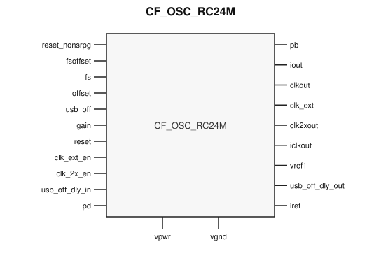

# CF_OSC_RC24M

> Crystal-less 24 MHz-class RC oscillator

The public GDS is an abstract; ChipFoundry
substitutes protected full geometry at tapeout.

This package ships an SRAM-style PG wrap `CF_OSC_RC24M` around analog leaf
`CF_OSC_RC24M_core`.

## Overview

`CF_OSC_RC24M` is a SkyWater 130 nm hard macro used as the on-chip main
oscillator when no crystal is present. Instantiate `CF_OSC_RC24M`.

Frequency select `fs[2:0]` sets the IMO output in the 3–96 MHz class
(including a 24 MHz USB-mode setting). `clkout` can also take an external
clock when `clk_ext_en` is asserted. `clk2xout` is the doubled clock when
`clk_2x_en` is high. Trim is an 8-bit offset DAC plus USB-mode gain.

The block needs a stable ~0.8 V voltage reference (`vref1`) and ~9.6 µA
current reference (`iref`) from a bandgap. Optional capacitance on `pb`
reduces jitter. Analog supply is 1.6–2.0 V, industrial −40 °C to 100 °C.

Macro size is 143.00 × 390.42 µm (15 µm halo around analog leaf
113.00 × 360.42 µm). Customer PG for chip PDN is `vpwr` / `vgnd`. Well taps
`vpb` / `vnb` are tied inside the wrap.

## Installation

```bash
pip install cf-ipm
ipm install CF_OSC_RC24M --version 0.2.1
```

Use `hdl/gl/CF_OSC_RC24M.v` as the customer blackbox, `layout/lef/CF_OSC_RC24M.lef`
for P&R, and `layout/gds/CF_OSC_RC24M.gds` / `layout/mag/CF_OSC_RC24M.mag` for the
public wrap. `CF_OSC_RC24M_core` is the analog leaf (empty Verilog, pin-only
abstract). ChipFoundry substitutes vault GDS into `CF_OSC_RC24M_core` at tapeout.
P&R uses the wrap LEF (`vpwr` / `vgnd` only).

Functional sim compiles `verify/beh_model/CF_OSC_RC24M_core.v` **instead of** the empty `hdl/gl/CF_OSC_RC24M_core.v` stub. See `verify/beh_model/README.md`.

## Features

- Crystal-less IMO with `fs[2:0]` frequency select (3/6/12/24/48/67/80/96 MHz class)
- `clkout` muxes IMO or `clk_ext`; `clk2xout` is the doubled clock
- 8-bit `offset` trim plus USB-mode `gain[5:0]` / `fsoffset[2:0]`
- Power-down `pd` and sleep-start `reset_nonsrpg`
- Bias inputs `vref1` (~0.8 V) and `iref` (~9.6 µA)
- Optional jitter capacitor node `pb`
- Ideal Verilog behavioral model under `verify/beh_model/` for functional sim
- Customer cell `CF_OSC_RC24M` 143.00 × 390.42 µm (15 µm halo around analog leaf 113.00 × 360.42 µm)
- Chip PDN is `vpwr` / `vgnd`. Well taps `vpb` / `vnb` are tied inside the wrap.

## Pinout

Customer documentation includes a pinout of the integration cell only.
Internal schematics and architecture block diagrams are not published.



Pin names and directions match the public wrap (`layout/lef/CF_OSC_RC24M.lef`)
and the blackbox stub (`hdl/gl/CF_OSC_RC24M.v`).

## Pin Description

Directions and widths are taken from the shipped Verilog in `hdl/gl/CF_OSC_RC24M.v`.

| Name | Direction | Width | Description |
|---|---|---:|---|
| `reset_nonsrpg` | input | 1 | Reset used when starting from sleep. |
| `pb` | output | 1 | P-bias node; optional external capacitor for jitter reduction. |
| `fsoffset` | input | 3 | Frequency-select offset. |
| `fs` | input | 3 | IMO frequency select. |
| `offset` | input | 8 | Main frequency-trim DAC. |
| `usb_off` | input | 1 | USB-mode disable. |
| `gain` | input | 6 | USB-mode gain. |
| `iout` | output | 1 | Oscillator current output. |
| `reset` | input | 1 | Oscillator reset. |
| `clk_ext_en` | input | 1 | Route `clk_ext` onto `clkout`. |
| `clkout` | output | 1 | Main clock output. |
| `clk_ext` | inout | 1 | External clock input. |
| `clk_2x_en` | input | 1 | Enable doubled clock output. |
| `clk2xout` | output | 1 | Doubled clock output. |
| `iclkout` | output | 1 | Internal IMO clock. |
| `vref1` | inout | 1 | ~0.8 V voltage-reference input. |
| `usb_off_dly_out` | output | 1 | Delayed USB-off output. |
| `usb_off_dly_in` | input | 1 | Delayed USB-off input. |
| `pd` | input | 1 | Power-down. |
| `vpwr` | input | 1 | Core supply. |
| `vgnd` | input | 1 | Ground. |
| `iref` | inout | 1 | ~9.6 µA current-reference input. |

`CF_OSC_RC24M_core` also has well taps `vpb` / `vnb`. The wrap ties
`.vpb(vpwr)` and `.vnb(vgnd)`. Do not connect those pins at chip level.

In OpenLane / LibreLane, hook chip PDN with
`PDN_MACRO_CONNECTIONS: "u_cf_osc_rc24m vccd1 vssd1 vpwr vgnd"` and connect
`.vpwr(vccd1)`, `.vgnd(vssd1)` under `USE_POWER_PINS`. Do not list `vpb` /
`vnb` on the wrapper instance.

## Limitations and Open Issues

- Verilog in `hdl/gl/CF_OSC_RC24M.v` is a structural wrap around an empty
  `CF_OSC_RC24M_core` blackbox. Functional sim uses `verify/beh_model/CF_OSC_RC24M_core.v` (ideal model, not SPICE).
- Liberty is not in this first wrap drop. P&R uses the wrap LEF.
- Companion process-variant analog tops stay foundry-only. This package
  ships the wrap around the public analog leaf.
- Voltage and current references are not generated on-macro. A crystal-less
  SoC should also instantiate `CF_BGR`.

## Release History

| Version | Date | Notes |
|---|---|---|
| 0.2.0 | 2026-09-06 | First SRAM-style PG-wrapped package. |
| 0.2.1 | 2026-09-26 | Core fill-exclude covers so fillgen does not overwrite the analog. LEF pin directions match the Verilog port types. Ideal behavioral model for functional sim. |
