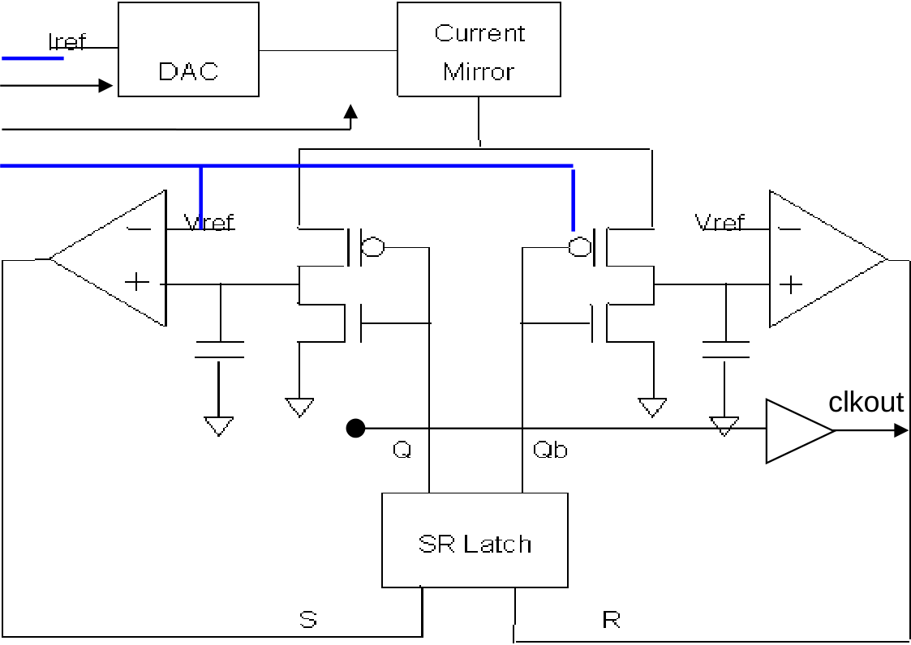
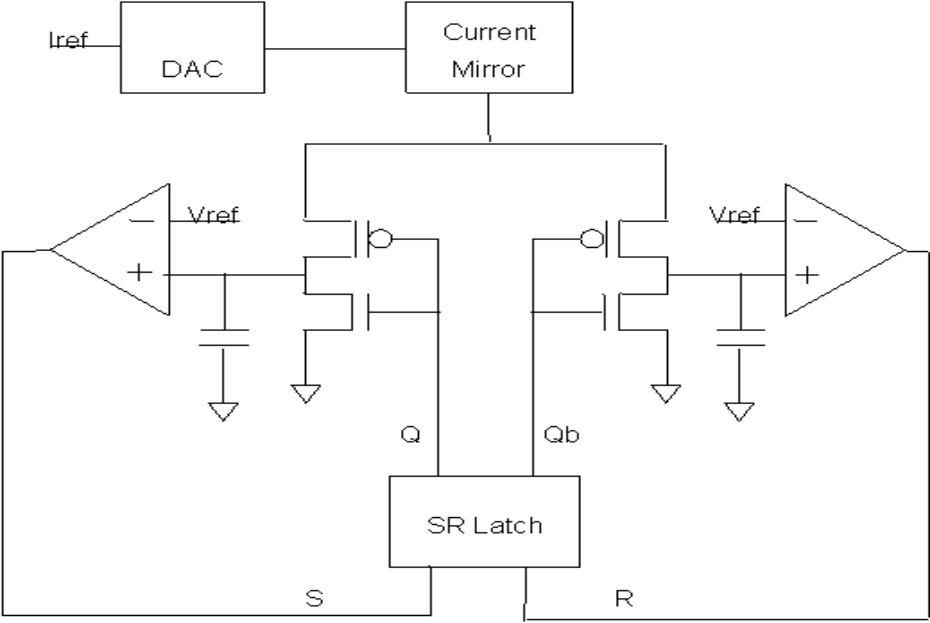
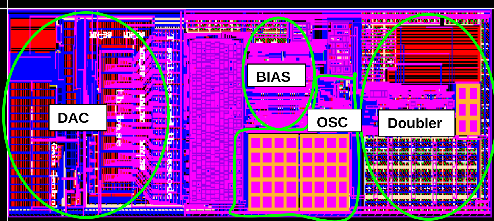
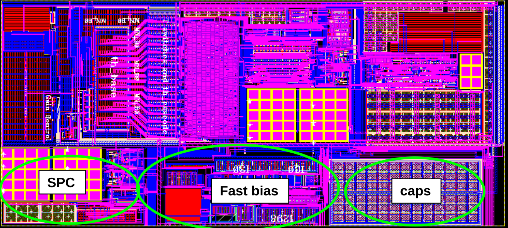

# CF_OSC_RC24M

> **Draft for review.** Not a released spec. Figures are the original datasheet crops that passed branding review; any figure without a cached clearance was left out. Vendor wording may still be present in the text.

- Vendor block: `s8intosc`
- Pages merged: 59/59
- Figures published: 6/10
- Skipped or invalid caches:
- (none)
- Figures not published:
- `src-af8512997d1dad41-p0001-figure-0000` — page logo, header, footer, or marketing tagline
- `src-af8512997d1dad41-p0019-figure-0001` — vendor cell name or part number legible in crop
- `src-af8512997d1dad41-p0032-figure-0001` — vendor cell name or part number legible in crop; (CDFcellName) placeholder text is not a valid cell name and should be replaced with actual vendor part number
- `src-af8512997d1dad41-p0037-figure-0001` — vision extraction failed: Ollama request failed: timed out

---


> 24 MHz RC Oscillator

## Overview

This evidence describes the s8intosc block, which is a highly accurate crystal-less oscillator IP (Internal Main Oscillator or IMO) in the PSoC family, used as the main clock generator. The oscillator provides programmable output frequencies from 3 to 96 MHz, includes a frequency doubler, and uses an 8-bit trim for frequency centering. It supports a USB mode with improved linearity and resolution but higher IDD, and includes a smaller SPC clock for Flash pump operations. The block has features like fast bias mode for <500 ns start-up, dynamic clock switching, and power switch for low leakage. The IP is validated for the industrial temperature range (-40 to 100°C).

The evidence describes the CF_OSC_RC24M block as an internal oscillator with specified frequency stability, area, and power metrics, configuration options, and application use cases. It details the block's frequency stability ranges, area, current consumption, and configuration capabilities, along with typical applications and test procedures.

The document is a block requirements objective specification (BROS) for the s8intosc HardIP, covering critical requirements, architecture overview, and related specifications. It lists references to various design best practices and methodologies, including those for Monte Carlo simulation, power/ground noise simulation, and circuit design. The document also outlines sections for block applications, architecture, pin lists, timing requirements, and power modes, with a focus on the s8intosc block.

This is a block requirements document for a HardIP block, specifically the s8intosc, which is part of an Infineon Technologies company document. It outlines various sections including test modes, register definitions, trim information, power architecture, block derivative strategy, and integration requirements. The document also covers technical specifications, IP integration information, and operating procedures.

An Infineon Technologies company document page listing block requirements and table of contents, with a specific mention of a 's8intosc HardIP BLOCK REQUIREMENTS OBJECTIVE SPEC (BROS)' and a table of tables. The document is confidential and references a specific block history table, with page 5 of 51.

The S8 Hard IP block s8intosc is documented for its requirements, including updates for adding external capacitor to Vpwr for jitter reduction, reset_nonsrpg for reset to start up from sleep, and changes to oscillator trim and PSOC3 cell features.

The document is a version history for a block specification, detailing updates to the Krypton and Indium cells, including changes to the 36MHz oscillator, trim resolution, USB mode fixes, and template updates for various revisions.

The evidence describes the block requirements and specifications for the s8intosc HardIP, including historical updates and reference documents. The document outlines responsibilities for block development and review, and lists relevant reference documents. The block is part of the S8RF HARDIP and S8CAPOSC families. The evidence does not directly state specific features, architecture, integration, or limitations of the CF_OSC_RC24M block, as the content is focused on general block requirements and document references.

The block is part of a list of related specifications and best practices for chip design, including topics such as Monte Carlo simulation, power/ground noise simulation, circuit design, and various integration and design methodologies.

This page lists various references and standards for the s8intosc block, including related memos and external standards.

The block is used as the main oscillator for CPU and logic, operates at 24Mhz for USB clock, generates double the frequency output, and has specific modes for Flash system and higher CPU speeds. It has high precision outputs with specific accuracy and temperature ranges, includes a frequency doubler, and has a 36MHz clock for SPC.

The block generates two clocks: a clkout (which can be the internal 3/6/12/24 MHz clock or an external clock) and a clkoutx2 running at twice the clkout frequency, with a frequency accuracy of +/-2.0% over temperature and voltage variation for frequencies <= 24 MHz. It uses a circuit that alternately charges two capacitors to a reference voltage (0.8V) using a precise current source, with comparators and an SR flip-flop to switch the charging current between capacitors, and a frequency doubler to produce clkoutx2. The frequency tolerance is adjusted by trimming the charging current with a DAC. It includes a power down circuit that places the oscillator in zero current sleep mode with clock outputs held to ground, and a Reset signal that stops the clock and resets outputs to ground. A 5-bit DAC trims the 36 MHz SPC oscillator current from a bandgap reference. The block supports 3/6/12/24/48/96 MHz clock outputs for the main oscillator and a 36 MHz clock for the SPC oscillator.

The block has an 11-bit DAC for trimming the oscillator, with 8-bit main DAC using thermometric coding for monotonic behavior, a 3-bit sub-DAC for USB, and gain control for step size adjustment. The oscillator frequency is adjusted via offset trimming based on USB traffic, with specific frequency changes per bit at 24 MHz.

The block generates a 24 MHz reference frequency with configurable gain and offset settings for process, voltage, and temperature variations, using an oscillator core that alternates charging of capacitors to a threshold level via comparators and an SR flop. The frequency change at each bit is specified as 30 kHz, 15 kHz, and 7.5 kHz for bits 2, 1, and 0 respectively. The gain control is validated only in USB mode, with the MSB bit always zero. The recommended gain-offset combinations for different process corners (Tt/trtc/1.8/25, Ff/hrlc/1.95/-40, Ss/lrhc/1.55/100) are provided, with frequencies ranging from 23.83 to 25.29 MHz and a step size of 62.2 or 62.7 kHz. The oscillator core topology involves charging one of two capacitors alternately, with comparators changing state when the capacitor reaches a threshold level (Vref=0.8), which sets or resets an SR flop to initiate charging of the other capacitor.

The oscillator block has a constant current source and a capacitor that is discharged instantaneously through a NMOS switch. The key design issues for the oscillator core include comparator, current switch, and flip-flop propagation delays, noise management, and frequency accuracy. The frequency accuracy is affected by comparator delays at higher frequencies and current source accuracy at lower frequencies, as well as mismatch in the current sources of the bias circuit, which causes temperature-dependent output current and impacts frequency stability. The output frequency stability is determined by these two opposing factors, and there is no significant difference in accuracy in the 3-24Mhz range. At higher frequencies, comparator delays dominate and mainly determine the accuracy.

The Frequency Doubler circuit multiplies the clkout frequency by two and uses a delay-lock-loop circuit with a current from a DAC and a transconductance amplifier to achieve 50% duty cycle, with limitations on input frequencies and duty cycle dependence on input clock, and the 36Mhz oscillator is a cut down version of IMO with a 4 bit DAC for trimming to 36Mhz and requires a separate reference current.

Describes the Clock MUX circuit, USB/Non-USB modes, and capacitor on p-bias node for the oscillator block, including behavior and requirements for transitions and jitter reduction.

This page describes a 24MHz RC oscillator block with requirements for current and voltage references, jitter reduction capacitors, and a fast bias option. It includes a table showing the relationship between capacitor values on the pb node and jitter, and specifies the need for a stable 9.6uA current reference and 0.8V voltage reference. The block also has a fast bias mode that uses a crude reference to enable the oscillator independently of the bandgap, with synchronous switching to normal mode.

The block generates a trimmed reference voltage for frequency control and supports specific frequency modes with bias adjustments.

The block has requirements for sleep and wakeup operations, including the need to assert ISO before sleep to prevent clock output from becoming undefined, with specific timing considerations and power management during transitions.

The block provides frequency selection through control inputs FS[2], FS[1], and FS[0] which set the output frequency to 12Mhz, 6Mhz, 24Mhz, 3Mhz, 48Mhz, 67Mhz, 80Mhz, or 96Mhz. It also controls clock outputs based on PD, Clk_ext_en, and Clk_2x_en inputs, with Clkout and Clk2xout outputs set to 0, Clk_ext, IMO clock, or 2x the selected clock.

The block supports three frequencies selected by the fs<2:0> bits. The table provides configuration modes for PSOC3, including sleep, powerdown, and FIMO modes. The block has specific bulk pins for substrate and well connections, with vnb as the main substrate pin, vpwb as the main Nwell bulk connection, and vdnw as the DNWELL bulk connection. The block does not have DFT/BIST pins or soft isolated bulk from the main substrate.

The block generates a clock and is the clock generation circuit expected to be placed in the digital domain. It has power supply inputs vpwr and vgnd for a low voltage supply (1.6-2V). In PSOC3 version, vpwr is switched internally controlled by the 'sleep' input, and digital outputs are forced to 0V in sleep mode using an active high 'iso' input. References must be stable before using the clock to avoid glitches; reset must not be lifted before both voltage and current references are stable. Bias inside the IMO has its own start up time with a delay of less than 4us for the first pulse in worst case, and settling time of less than 6us. During switch from external to internal clock, references must be stable before switchover; if switch happens at same time as IMO enable, there is a 4us window with no clock output. If IMO enabled 6us before switchover, smooth transition without idle period is ensured. In FIMO mode, first pulse occurs within 300ns and settles to 95% of final frequency by 500ns. There is a large overshoot in references for the fast bias circuit during start up that cannot be reduced as it requires adding capacitance to bias.

The evidence describes operational constraints and start-up characteristics of the FIMO oscillator, including frequency trim configurations, startup timing issues, and error sources affecting clock stability during boot and wake-up from sleep.

Describes mode transitions for the RC24M oscillator block, including synchronous switchover between FIMO and IMO modes, frequency constraints, and powerdown control for fast bias circuit.

The block dynamically switches IMO frequency by changing FS<2:0> and offset<7:0> values, with specific timing requirements for trim value changes; it interfaces with logic core via LV control signals and receives voltage and current references from bandgap; it requires reset for initialization but does not stop the oscillator; it has two power modes, active and disable, and enters USB mode at 24Mhz with extra current.

This block has multiple operational modes including normal mode, FIMO mode, disable mode, and powerdown (sleep) mode. It uses monotonic trim for frequency adjustment with specific bit configurations for different oscillators (IMO, F36, FIMO). The block does not have registers or specific test modes, and its interface to bus architectures is not applicable.

The block provides an output clock according to the frequency select setting in different modes like IMO and FIMO, modeling doubler and SPC clock functionality. It uses a time scale of 1ps/1ps for modeling clock period with integers, models start-up time for all blocks, keeps the old frequency during settling time when trim is changed, and models trim dependency. The period for each clock is calculated with nominal value and trim

A block that handles USB to non-USB transitions with internal delays, includes a delay locked model for doubler, and requires voltage and current references to be shielded and stable before reset or clock usage.

The block has requirements for input signal transition times, power and ground IR drop, placement under pad frame, shared VREF and power/ground connections, USB mode gain functionality, external clock doubler usage, clock mux operation, input frequency limits for doubler, and output clock frequency and routing requirements.

A M3 ground shield is placed over the complete PSOC3 block so that M4 can be used to route signal over the block. No routing of signals in M1/M2 is allowed. No sensitive signals must be routed very close to the clk2xout signal which can switch at frequencies as high as 96 MHz. Frequency accuracy, not jitter is the focus of the oscillator block. No specific jitter reduction techniques/simulations are employed for this block apart from capacitive bypass provided. Jitter will be characterized from silicon and documented in char memo for reference. Cycle to cycle and N cycle jitter will be documented. No specific timing constraints for this block. IR drop requirements for power/ground are part of usage guidelines. No specific bus interface physical interface requirements. No specific miscellaneous constraints. HardIP_BlockArea. No specific block symbol provided.

The evidence describes the s8intosc HardIP block's technical specifications, operating conditions, DC and AC specifications, and integration information, with references to other sections for block functionality.

The CF_OSC_RC24M block is a hard IP block used in integration targets Leopard and Panther. It has prerequisite IP requirements including scs8lpa, s8rf, and s8bg. The block has no additional requirements. The document also mentions that public cells used in Krypton and Indium products are not included in this release as public cells since PCIOS is not available for those products.

The block is a port from S4 design; three oscillator types were evaluated, with the third option (using single reference and two capacitors) selected for best frequency accuracy; frequency accuracy and trim range are critical parameters, with corner simulations and Monte Carlo simulations performed to account for variations across temperature and process corners.

The block generates a reference voltage and operates in multiple modes including Fast IMO and IMO, with simulations performed for accuracy, start-up behavior, and switch-over between modes.

The evidence describes simulation strategies for the ISB (Internal System Block) of the CF_OSC_RC24M block, including conditions for powerdown and sleep mode, and references to test bench directories and test case details.

The block is an analog block where current mirror matching of LOD is critical for frequency matching and for DAC layout for trim-monotonicity. It is not possible to perform logic equivalency checking, and behavioral model verification is done through verilog simulations and waveform comparison. The block has completed layouts with snapshots provided, and test bench implementation involves applying stimuli from the EDLO simulation bench.

The block has no laser or metop elements, all programmability based on register bits, spare elements added per analog layout best practices; the block cannot be placed near IO diffusions or in critical region, designed before 6u latchup rule; includes SPC, caps, Fast bias, Doubler, DAC, BIAS, OSC components.

The block undergoes electromigration, IR drop, ESD, and noise analysis, with specific characterization conditions for frequency variation, IDD, duty cycle, and jitter.

The document provides requirements for measuring frequency variation, IDD, duty cycle, SPC clock, doubler, and FIMO mode for the internal oscillator block.

The evidence describes the block's performance characteristics, including startup time, settling time, and characterization criteria for frequency accuracy and guard-band specifications. It references silicon validation results from 15 devices meeting specifications with good CPK values and lists related documents for detailed characterization data.

The CF_OSC_RC24M block produces a 24 MHz internal reference clock with 4-bit trim capability for frequency accuracy across voltage and temperature. The block's output is used for clock generation at 24 MHz, 12 MHz (divided by 2), 6 MHz (divided by 4), and 3 MHz (divided by 8) with specific machine guardband values. The block is characterized only for the industrial temperature range, with automotive characterization planned for a separate NPP. The block does not support 80/96 MHz frequencies in production, and FIMO mode is only used at 12 MHz in Leopard.

The block has a trim algorithm for meeting +/-1% accuracy for 3Mhz in leopard using the current reference tempco trimming as documented in UMX-390. It requires re-trimming multiple times in conjunction with bandgap trimming. The trim procedure involves multiple steps at different temperatures: sort 1 at 100C, sort 2 at 30C, sort 3 at -40C, and class at 30C and 100C. The block also has specified frequency parameters including Fosc, N, Fout, and MGB values.

The evidence discusses the production test coverage plan for a block, stating that every die is trimmed and screened for each frequency mode in production, ensuring 100% test coverage for the block. It also mentions that certain parameters like IDD, duty cycle, start up/settling times, and start up accuracies will not be tested in production.

The document specifies general record retention requirements and appendix references, unrelated to the block's function, features, architecture, integration, or limitations.

The document provides requirements for the s8intosc block, which is a hard IP block for internal main oscillator functionality in the s8p-5r technology, targeting products leopard and panther, with various deliverables listed including layout, symbol, schematic, and simulation data.

The evidence item is a list of supporting documents related to the s8intosc HardIP block, including various analysis reports, characterization results, and design change documents. The list includes entries such as BAL-223, BYG-218, JUZ-232, and others, each referencing specific aspects of the block's development and performance. The page also contains standard document header and footer information, including a company confidentiality notice and page number.

VUA references for s8intosc block including characterization results, simulations, and design changes.

The document is a project management schedule for the 's8intosc' HardIP block, listing milestones, current and baseline cycle times, and deltas to baseline. It also references a product named 'Leopard' with a current schedule of 'PR4-1052'.

The document describes revision history for the s8intosc block, including updates related to pin list changes, usage guidelines, and silicon measurements for various configurations and cells such as PSOC3, Krypton, and Indium.

The document is a block requirements objective specification for a HardIP block, including revision history and references to related specifications and documents. The block is associated with PSoC3 Leopard (8051) and other product lines, and the document references Excel tables for HardIP specifications. The document is confidential and marked as uncontrolled when printed.

The evidence contains worksheet instructions for filling out various tables related to IP block specifications, including public cells, block area, pin lists, operating conditions, and DC/AC specifications.

The evidence identifies the CF_OSC_RC24M public cell as a Hard IP w/o CTL no MV in the s8p-5r technology, with associated pins including CLK36M, clk2xout, clkout, iclkout, usb_off_dly_out, FS, Gain, IREF, IREF_36M, ISO, PD, PD_36M, SLEEP, SPC_CLK_TR, VREF1, clk_2x_en, clk_ext, clk_ext_en, en_fast, fsoffset, offset, pd_fast_bias, reset, reset_nonsrpg, trim_res, usb_off, usb_off_dly_in, vgnd, vnb, vpb, vpwr, vdnw, pwr.

RC oscillator operating at 24 MHz with 36 MHz capability, featuring trimmed reference voltage generation and multiple clock outputs

A block with 33 pins, including supply, ground, bulk, digital, and analog connections, with specific functions like power down, sleep, reset, trim bits for frequency control, and clock outputs.

The evidence details the operating conditions for an internal oscillator, including voltage, temperature, and reference parameters with specified ranges.

The block consumes supply currents ranging from 150 uA at 3 MHz to 700 uA at 80 MHz, with specific values for different frequencies and modes including USB mode, and leakage currents up to 16144 nA at 150C when PD=1 and SLEEP=0.

The block provides output frequency variability across voltage and temperature at various frequencies, including 3, 6, 12, 24, 48, 67, 80, and 96 MHz, with and without Monte Carlo mismatch data. It also specifies min/max trim ranges for these frequencies, startup and settling times, duty cycle variations, and startup errors in FIMO mode.

The block generates a 24 MHz clock with support for external clock input, clock doubling, and various trim and control signals for frequency and power management.

### Function

It is used as the main clock generator which drives the CPU and logic, providing programmable output frequencies ranging from 3 to 96 MHz, and includes a frequency doubler.

The block provides a master clock for chip logic and a locked frequency output for USB applications based on data rate.

Generates two clocks: a clkout (which can be the internal 3/6/12/24 MHz clock or an external clock) and a clkoutx2 running at twice the clkout frequency, with a frequency accuracy of +/-2.0% over temperature and voltage variation for frequencies <= 24 MHz.

The block trims the oscillator frequency using an 11-bit DAC with an 8-bit main DAC and a 3-bit sub-DAC for USB, and adjusts the frequency step size through gain control to match incoming USB traffic.

The block generates a 24 MHz reference frequency with configurable gain and offset settings for process, voltage, and temperature variations, using an oscillator core that alternates charging of capacitors to a threshold level via comparators and an SR flop.

The oscillator block has a constant current source and a capacitor that is discharged instantaneously through a NMOS switch, and the key design issues for the oscillator core include comparator, current switch, and flip-flop propagation delays, noise management, and frequency accuracy. The frequency accuracy is affected by comparator delays at higher frequencies and current source accuracy at lower frequencies, as well as mismatch in the current sources of the bias circuit, which causes temperature-dependent output current and impacts frequency stability. The output frequency stability is determined by these two opposing factors, and there is no significant difference in accuracy in the 3-24Mhz range. At higher frequencies, comparator delays dominate and mainly determine the accuracy.

The oscillator block can be used in USB or Non-USB mode, where USB mode has better DNL behavior at the expense of higher power, with current in the DAC increased to ~16 times to improve transistor over-drive and reduce mismatches, while current is scaled back in the final current source to maintain frequency.

It generates a voltage reference output as the difference of Vts, constant across VDD and temperature to the first order, and controls frequency variation across temperature through resistor-related current and voltage references.

The block supports sleep and wakeup operations with specific timing for ISO and sleep signals to manage power and prevent clock output from becoming undefined, ensuring proper functionality at low voltage levels.

It provides multiple selectable output frequencies and controls clock outputs based on input settings.

The block supports three frequencies selected by the fs<2:0> bits.

It is the clock generation circuit and it expected to be placed in the digital domain.

The block provides a clock for counting delay between regulator power good and stable references during boot and wake-up from sleep, with frequency variations affecting start-up time and reference stability.

The block supports synchronous switchover between FIMO and IMO modes without glitches, with frequency transitions limited to maximum 48Mhz IMO frequency for no functional issue, and a frequency overshoot of less than 10% during transitions.

The block generates an output clock frequency up to 96Mhz, and includes requirements for input signal transition times, power and ground IR drop, placement under pad frame, shared VREF and power/ground connections, USB mode gain functionality, external clock doubler usage, clock mux operation, input frequency limits for doubler, and output clock frequency and routing requirements.

It focuses on frequency accuracy, not jitter, with no specific jitter reduction techniques/simulations employed apart from capacitive bypass provided.

It generates a frequency with best accuracy across voltage and temperature variations, and provides sufficient trim range across process corners for frequency adjustment.

It generates a reference voltage and operates in multiple modes including Fast IMO and IMO, with simulations performed for accuracy, start-up behavior, and switch-over between modes.

The block supports high current mode at 24MHz for USB operation, operates at 67MHz for PSOC3 maximum, and at 96MHz for IP maximum.

The block generates a 24 MHz reference clock with programmable outputs and supports various control and configuration signals for clock generation and distribution.

The block operates with a 24M RC oscillator and provides a 36M clock output that can be directly brought to a pin or divided down for measurement.

Configures the chip in external clock mode to monitor output clock, then switches to internal clock mode and enables IMO to measure time for frequency stabilizing to 99% of final value, and switches IMO clock frequency and trims dynamically to measure time to settle to 99% of final frequency.

The block produces a 24 MHz internal reference clock with 4-bit trim for frequency accuracy across voltage and temperature, providing divided clock outputs at 12 MHz (divided by 2), 6 MHz (divided by 4), and 3 MHz (divided by 8) with specific machine guardband values.

The block generates a trimmed reference voltage and requires multiple trims in conjunction with bandgap trimming to meet frequency accuracy requirements at different temperature points.

This block ensures 100% test coverage as every die is trimmed and screened for each frequency mode in production, activating the complete circuit.

Generates a 24 MHz reference clock frequency for the internal main oscillator.

generates a 24 MHz reference clock

generates a 24 MHz reference clock and a 36 MHz reference clock with trimmed reference voltage

Generates a clock output, provides a 36 MHz clock output for SPC, and supports external clock input and clock doubling.

The block operates as an internal oscillator with a frequency directly proportional to the reference current and reference voltage ratio.

It generates output frequencies at 3, 6, 12, 24, 48, 67, 80, and 96 MHz with specified variability across voltage and temperature, provides min/max trim ranges for these frequencies, and supports FIMO mode with startup and settling times.

The block generates a 24 MHz clock with support for external clock input, clock doubling, and various trim and control signals for frequency and power management.

## Installation

Install the released package with IPM:

```bash
ipm install CF_OSC_RC24M
```

Use the files under `hdl/gl/` as blackbox declarations, `layout/lef/` for physical integration, `layout/gds/` for the public abstract, and `timing/lib/` for available characterized views. The public GDS is an abstract; ChipFoundry substitutes protected full geometry during tapeout.

## Features

- Programmable frequency from 3Mhz to 96Mhz
- Frequency stability better than +/-2% till 24Mhz and +/-5% till 96Mhz (excluding reference stability)
- Frequency stability better than +/-1% AT 3Mhz frequency with temperature slope compensation using the current reference.
- 8 bit trim for frequency centering
- USB mode with good linearity and resolution at the expense of higher IDD
- Frequency doubler for optional double frequency clock for supported input frequencies
- SPC clock to support flash pump operation
- Fast bias mode for <500ns start up time for improving chip start up time
- Smooth switching from Fast bias mode to normal mode and vice versa
- Dynamic clock switching from one frequency to other without glitches under specified conditions.
- Power switch included for low leakage
- Completely shielded layout in M3 for routing over the top using higher level metals
- Frequency is selected based on the FS<2:0> input.
- Configured into active or powerdown mode using the PD bit.
- Supports additional power mode where power is shut off through a power switch.
- Can be configured to work with a crude internal bias using the en_fast bit control.
- Special USB mode configured using the usb_off bit driven to zero.
- For each frequency, there is an associated trim value stored in flash to cancel out mismatches in current mirrors.
- Frequency output is directly observed and trimmed on each die and screened for accuracy in production test.
- The block generates a 24 MHz reference clock
- 36Mhz oscillator trim made finer to address timing constraints in Flash timing path
- 67/80Mhz options added for PSOC3 cell
- 36Mhz oscillator trim made finer to addre
- Added 2 pins. pb for adding external cap to Vpwr for jitter reduction. reset_nonsrpg for reset to start up from sleep
- Behavioral model update (CDT-11608)
- Added PSOC3 cell including a Fast bias for fast start up
- Logic bug fix in PSOC3 cell
- Updated the sleep wake up behavior of IMO for
- High Precision 3/6/12/24 output (+/-2%), excluding reference accuracy
- +/-1% operation for one frequency (3Mhz for PSoC3/5) with Iref trimmed to cancel oscillator variation
- +/-5% accuracy till 96Mhz
- Operation over 1.6V to 1.95V for all frequency
- - 40C to 150C junction temperature
- USB mode with improved DNL for trim DAC
- Frequency doubler which can double both an Internal/External Clock
- Separate 36 MHz clock for SPC
- Fast start-up option
- Outputs two clocks: clkout (3/6/12/24 MHz internal or external) and clkoutx2 at double the clkout frequency
- 36 MHz SPC oscillator gets trimmed current from bandgap reference with a 5-bit DAC
- 3/6/12/24/48/96 MHz clock output for main oscillator
- 36 MHz clock output for SPC oscillator
- An 11-bit DAC (offset [7:0] + fsoffset [2:0]) is used to trim the oscillator.
- The 8-bit main DAC has one binary weighted bit and seven thermometric bits for monotonic behavior and better DNL for USB oscillator.
- The binary to thermometric conversion is handled internally so the trim appears binary weighted to the end user.
- A 3-bit sub-DAC (fsoffset [2:0]) provides trim capability for full speed USB.
- The LSB current of the 8-bit DAC is mirrored and divided further, controlled by fsoffset [2:0] in binary weighted fashion.
- The effective frequency change step size of offset input is controlled through the gain input (gain [5:0]).
- Higher gain settings give lower offset step size (kHz/offset step) and vice-versa, applicable only in USB mode.
- The oscillator is tuned by external logic to match the frequency of incoming USB traffic.
- The clkout output supplies the clock to the locking logic to sample USB traffic.
- The locking logic updates offset [7:0] to modify the internal oscillator frequency to match incoming USB packets.
- The frequency change at each offset bit is 7.68 MHz for bit 7, 3.84 MHz for bit 6, 1.92 MHz for bit 5, 960 kHz for bit 4, 480 kHz for bit 3, 240 kHz for bit 2, 120 kHz for bit 1, and 60 kHz for bit 0, at typical 24 MHz condition.
- The frequency change at each bit is 30 kHz for bit 2, 15 kHz for bit 1, and 7.5 kHz for bit 0.
- The gain control is validated only in USB mode (24 MHz).
- The MSB bit of gain control is always zero.
- The recommended gain-offset combination for different process corners is provided for Tt/trtc/1.8/25, Ff/hrlc/1.95/-40, and Ss/lrhc/1.55/100.
- The frequency for Tt/trtc/1.8/25 is 25.29 MHz with a step size of 62.2 kHz.
- The frequency for Ff/hrlc/1.95/-40 is 24.33/25 MHz with a step size of 62.2 kHz.
- The frequency for Ss/lrhc/1.55/100 is 23.83/24.28 MHz with a step size of 62.7 kHz.
- The oscillator block has a constant current source and a capacitor that is discharged instantaneously through a NMOS switch
- Frequency accuracy is affected by comparator delays at higher frequencies and current source accuracy at lower frequencies
- Mismatch in the current sources of the bias circuit causes temperature-dependent output current and impacts frequency stability
- There is no significant difference in accuracy in the 3-24Mhz range
- At higher frequencies, comparator delays dominate and mainly determine the accuracy
- multiplies the clkout frequency by two
- inputs include FIN (SYSCLK), a current bias IB from the DAC, and a voltage bias VB from the Bandgap Reference
- has a separate enable control
- uses an XOR gate with a clock signal and a clock signal delayed by one-fourth the period to create a 50% duty cycle frequency doubler
- employs a delay-lock-loop circuit with capacitors charged through current starved inverters for delay
- uses a current composed of a current mirrored from the DAC and a current from a transconductance amplifier in a closed loop system
- uses a resistive divider to provide a vdd/2 reference to the amplifier
- uses an RC low pass filter to generate the DC component of the F2x signal
- maintains an average duty cycle close to 50% through the loop
- duty cycle highly dependent on the duty cycle of the input clock
- reflects input clock duty cycle in the period of two consecutive doubled cycles
- operates primarily at 24Mhz input to generate a 48Mhz output clock for USB logic
- operates up to 48Mhz input in PSOC3 version
- does not support input frequencies above 48Mhz
- not advisable for use at frequencies less than 12Mhz
- in external clock mode, the IMO must run as both share bias currents
- is a cut down version of IMO with lower DAC resolution
- uses a 4 bit DAC to trim the oscillator to 36Mhz
- requires a separate reference current from the reference block
- can share voltage reference with IMO with proper isolation
- The Clock MUX circuit selects the system clock, clkout, from either the internal IMO or an external clock, ensuring a glitch-free transition and providing a full cycle of set-up time from SYSCLK to output disable.
- The oscillator block inherently delays the usb_off by three cycles of IMO clock to provide settling time for biases, requiring external connection of Usb_off_dly_out to Usb_off_dly_in.
- The oscillator can be operated in USB mode for all frequencies if a current overhead of 150 uA can be tolerated.
- The Clock MUX circuit double synchronizes the enable of the newly selected clock to that clock after current clock selection is disabled, then on the subsequent negative edge, SYSCLK is enabled to output the newly selected clock.
- The Clock MUX circuit requires the source clock to be running before it is selected.
- The oscillator block has a 1 us delay requirement for usb_off_dly_in assertion after usb_off assertion when changing from 0 to 1.
- The oscillator block allows simultaneous change of both usb_off and usb_off_dly_in during transition from 1 to 0.
- The oscillator block can have frequency surges due to bias settling time constraints during USB/Non-USB mode transitions.
- The oscillator block uses a capacitor on the p-bias node to reduce jitter, which is high (4ns) if vpwr is reduced or increased by 200 mV instantaneously (1 ns rise/fall time, 10 ns period).
- A current reference of 9.6 uA and voltage reference (0.8V) is required for this block
- Frequency variation is directly proportional to % variation in Iref divided by Vref
- For the leopard version, 35pF is integrated into the IP
- A separate cell is developed for PSOC3 that combines the s8intosc_top with the SPC clock, dedicated capacitor for jitter reduction and a Fast bias circuit (FIMO option)
- 6 bit trim is provided for frequency trim for the bias
- It needs to be trimmed separately for each frequency mode
- It can be enabled/disabled through en_fast input to the block
- FIMO is supported only for 12/24 and 48Mhz modes
- If FS selects 3 or 6Mhz, FIMO will work at 12Mhz
- If FS selects 96Mhz, FIMO will work at 48Mhz
- The same trim values used for one frequency may cause static error in frequency of other modes due to mismatches in the bias circuit and comparator delay contributions
- FIMO can be enabled/disabled through en_fast input to the block
- It is an asynchronous input and switches between IMO and FIMO mode from next internal clock edge
- For PSOC3, boot frequency is 12Mhz
- Wake up from sleep modes can start at other frequencies or switch to higher frequencies after 2 cycles once started up in 12Mhz mode
- A sleep input is added to PSOC3 block which goes to the power switch of the block for leakage reduction
- ISO signal must be asserted to force digital outputs of the block to low
- ISO must be asserted 2-3 ns before sleep to avoid clock output from going undefined
- On asserting ISO, clock stops immediately with state=low
- It is advisable to generate ISO on the negative edge of the clock to avoid short pulses
- For waking up, sleep must be de-asserted first, which can be done along with regulator power up
- Powergood signal at about 1.5V supply can be used to de-assert reset or reset_nonsrpg and ISO signals
- The IMO in the main oscillator mode and FIMO mode operates with no considerable frequency change at 1.4V
- For FIMO mode, pd_fast_bias must be low while waking up
- For IMO mode, reference stability must be ensured before lifting reset to avoid clock glitches
- Supports frequency selection with inputs FS[2], FS[1], and FS[0] to set output frequencies of 12Mhz, 6Mhz, 24Mhz, 3Mhz, 48Mhz, 67Mhz, 80Mhz, or 96Mhz
- Controls clock outputs using inputs PD, Clk_ext_en, and Clk_2x_en to set Clkout and Clk2xout to 0, Clk_ext, IMO clock, or 2x the selected clock
- 00x selects 12Mhz
- 010 selects 24Mhz
- 011 selects 12Mhz
- 1xx selects 48Mhz
- SLEEP=1 powers off complete power
- 0000 mode is IMO mode in test mode with extra current in fast bias to allow switching back/forth
- 0001 mode is FIMO mode with fast startup
- 0010 mode is IMO mode in normal operation with low stby for fast bias
- 0011 mode is illegal because it can't power down fast bias in FIMO mode
- 01xx mode is powerdown mode with an internal OR gate to power down pd_fast_bias if PD=1
- It has power supply inputs vpwr and vgnd for a low voltage supply (1.6-2V).
- In the PSOC3 version, vpwr is switched inside. Switch is controlled by the 'sleep' input. Digital outputs are forced to be at 0V in sleep mode using an active high 'iso' input.
- References need to be stable before using the clock to avoid glitches. It need to be ensured that the reset for the block is not lifted before both voltage and current references are stable.
- Bias inside the IMO has its own start up time. Even if the references are stable, there is a delay of less than 4us for the first pulse to come out in the worst case. Settling time of the IMO is of the order of less than 6us.
- While switching from external to internal clock, it need to be made sure that the references are stable before the switch over. If the switch over happens at the same time as IMO enable, there will be a window of 4us where no clock comes out of IMO. Once it starts, it is not expected to give out glitches. If the IMO can be enabled 6us before the switchover, a smooth and quick transition without any idle period to the correct frequency can be ensured.
- While starting up in FIMO mode, first pulse occurs within 300ns and the oscillator settles to 95% of final frequency by 500ns.
- There is a large overshoot in the references for the fast bias circuit during start up. This cannot be reduced as it requires adding capacitance to bias.
- 6-bit frequency trim partially from NVL and partially from flash
- 2 MSB bits from NVL, 4 LSB bits default to 0110 or 0111 during boot
- 6-bit frequency trim value is valid during wake-up from sleep
- 12/24 MHz modes operate within 67 MHz limit for timing closure
- 48 MHz mode can cause frequency overshoot exceeding 67 MHz without 150 ns delay between de-asserting PD and reset
- 48 MHz mode can be switched after starting in 12 MHz mode within 2 clock cycles
- FIMO starts counting once regulator power good signal is valid (VDD=1.5 to 1.6 V)
- Synchronous FIMO to IMO switchover without glitches
- Transition limited to maximum 48Mhz IMO frequency for no functional issue
- Direct transition of 12Mhz FIMO to 48Mhz IMO is allowed
- Frequency overshoot of less than 10% during transitions
- FS setting can be changed after 5 cycles for IMO to switch to a new frequency
- Separate powerdown control (pd_fast_bias) for fast bias circuit
- dynamically switches IMO frequency by changing FS<2:0> and offset<7:0> values
- FS value change results in immediate output frequency change
- offset value change reflects slowly in output due to large settling time of bias circuit
- requires trim value change to settle within 5us before changing FS for lower to higher frequency transition
- requires FS change first before changing trim value for higher to lower frequency transition
- trim change allowed to settle for 5us after FS change
- frequency takes 5us to settle after 5 cycles of trim change
- interfaces with logic core with all LV control signals for proper operation
- receives voltage and current references from bandgap
- requires reset to initialize oscillator latch and flops inside clock mux to a known state
- reset gates the clock Mux output to low but does not stop oscillator
- reset should only be lifted once references are stable to avoid glitches
- advised to reset oscillator again when coming out of sleep mode if power to oscillator is cut off at chip level
- has two power modes: active and disable (PD=1)
- enters USB mode with about 150uA extra current when in active mode and usboff=0 and fs<1:0> = 24Mhz
- Operates in normal mode with sleep=0, pd=0, en_fast=0, where frequency is set by 3 bit frequency select inputs.
- Operates in FIMO mode with sleep=0, pd=0, en_fast=1, pd_fast_bias=0, where fast start up circuit provides bias to IMO, and frequency is limited to 12/48Mhz.
- Operates in disable mode with sleep=0, pd=1, where both FIMO and IMO active paths are shut off and sub-threshold leakages prevail.
- Operates in powerdown (sleep) mode with sleep=1, where power switch is cut-off, it is the lowest leakage mode, and outputs are forced to low using iso signal.
- Uses 8 bit monotonic trim for frequency with 7 bits implemented in thermometric code, and binary to thermometric conversion handled within the block.
- Each frequency output requires separate trim, and IMO trim involves stepping through the code from 0 to 255 to select the optimum setting for frequency most close to target.
- Uses 4 bit trim for 36Mhz oscillator frequency, working similarly to IMO trim.
- Uses 6 bit trim for FIMO frequency, working similarly to IMO trim.
- No registers in this block.
- No specific DFT/test modes for this block, as the oscillator output is accessed and trimmed for each die.
- Interface to bus architectures is not applicable.
- Provides an output clock according to the frequency select setting in different modes like IMO and FIMO
- Models doubler and SPC clock functionality
- Uses a time scale of 1ps/1ps for modeling clock period with integers
- Models start-up time for all blocks
- Keeps the old frequency during settling time when trim is changed
- Models trim dependency
- Period for each clock is calculated with nominal value and trim bits
- Optional clock multiplier parameter is provided for making the default clock output to the max possible frequency as per tolerance
- 12Mhz FIMO has +/-10% tolerance
- FIMO trim is modeled in such a way as to get the worst case frequency range when untrimmed
- 2 different slopes are used for trim depending on the MSB value
- IMO and SPC trims are linearly modeled with respect to trim bits
- Gain in USB mode is modeled to change the frequency non-linearly as per design
- USB mode is expected to be used only at 24Mhz
- Oscillator will still oscillate properly for other FS settings as well
- A warning is provided when USB mode is operated at non-24Mhz setting but outputs are not corrupted
- Supports USB to non-USB and reverse transition with internal delays.
- Has a delay locked model for doubler which must be used when the doubler is used with external clock.
- Checks IMO to FIMO and FIMO to IMO transition timings by internal behavior modeling, resulting in clock output X if required timings are violated.
- Throws an error if ISO is not asserted before SLEEP.
- Max transition time on any input signal must be 5ns
- Max transition time for clock must be 1ns
- IR drop on power and ground together must not exceed 20mv
- This block consumes ~700uA current at highest frequency mode
- This oscillator must not be placed under pad frame to avoid the assembly stress related issues
- VREF going to IMO and SPC clocks must not be shared
- Power/Ground connections for SPC and IMO blocks must be independently connected to main bus
- Gain functionality must be used only in USB Mode
- If running doubler of external clock, IMO must be still enabled and placed with same FS setting corresponding to external clock used
- Both clock sources must be running while using the clock mux to switch over
- Doubler should not be used for input frequencies below 12Mhz and frequencies above 48Mhz
- Output clock frequency can be up to 96Mhz
- Care must be taken while routing this signal so that it is not coupled other signals and minimize the capacitance on this line (<100fF)
- vdnw input goes to a Deep Nwell. This could be shorted to vpwr of the block at chip level. This is provided to have an option to connect it to a non-switched power of the chip
- No specific timing constraints for this block.
- IR drop requirements for power/ground are part of usage guidelines.
- No specific bus interface physical interface requirements.
- No specific miscellaneous constraints.
- It uses a single reference and two capacitors to generate a saw tooth waveform
- Frequency accuracy is critical across voltage and temperature
- Trim range is critical to allow frequency adjustment across process corners with sufficient margin at ff corner at zero trim and greater than target frequency at ss corner at max trim
- Monotonicity is critical for easier tester trim implementation and for USB osclock
- It operates in multiple modes including Fast IMO and IMO
- It supports FIMO accuracy simulations for frequency variation across VDD and temperature
- It supports FIMO start up error simulations for various error sources
- It supports FIMO start up simulations to find when the first pulse appears from the oscillator and to find the settling time and over shoot due to bias start up at various modes
- It supports FIMO to IMO switch over simulations to ensure no glitches while transitioning
- It supports IMO start up and switchover transient start up simulations to find the start up time and measure settling time when IMO trim/FS is dynamically changed
- Supports high current mode at 24MHz for USB operation
- Operates at 67MHz for PSOC3 maximum
- Operates at 96MHz for IP maximum
- All programmability is based on register bits
- Spare elements are added as per analog layout best practices
- The block includes SPC, caps, Fast bias, Doubler, DAC, BIAS, and OSC components
- The block has a 24M RC oscillator frequency output that can be directly brought to a pin or divided down and measured.
- The block's frequency output is characterized for variation across VDD and temperature, IDD, duty cycle, and jitter.
- Brings the IMO output to a pin
- Selects the FS bits to fix the output frequency
- Measures average frequency using a scope or frequency counter
- Varying VDD/temperature to measure frequency
- Calculates frequency variation in percent
- Repeats for all fr
- 15 devices will be characterized from the production build devices to verify the frequency accuracy with 2MGB guard-band to specifications
- 15 devices will be characterized for un-trimmed parameters and CPK will be calculated to meet at least 1.33
- 15 devices of leopard ES3 are characterized on bench with results meeting the spec with good CPK
- 4-bit trim for the SPC clock
- 24 MHz internal reference clock generation
- 12 MHz output (24 MHz divided by 2)
- 6 MHz output (24 MHz divided by 4)
- 3 MHz output (24 MHz divided by 8)
- 80/96 MHz frequencies not used in production
- FIMO mode used only at 12 MHz in Leopard
- 3-67 MHz frequency range characterized
- 24 MHz, 12 MHz, 6 MHz, and 3 MHz outputs supported with specific machine guardband values (0.002-0.08%)
- Fosc(Mhz) 96, N 8, Fout(Mhz) 12, MGB in % 0.002
- Fosc(Mhz) 36 (SPC), N 12, Fout(Mhz) 3, MGB in % 0.0375
- Supports multiple frequency modes of IMO, SPC clock, and FIMO frequency modes
- Meets +/-1% accuracy for 3Mhz in leopard using current reference tempco trimming
- Supports 24 MHz clock frequency
- Provides CLK36M, clk2xout, clkout, iclkout, usb_off_dly_out outputs
- supports 3-24 MHz range in Leopard ES3 Silicon
- supports 48-96 MHz range in Leopard ES3 Silicon
- provides SPC and FIMO preliminary characterization results
- improves accuracy for 3 MHz using IBG trim
- characterizes IMO jitter
- characterizes IMO IDD bench
- provides characterization plan for s8intosc
- includes doubler schematic and layout changes
- has 36 MHz oscillator DAC changes
- has 36 MHz oscillator RevB silicon correlation
- has 48 MHz frequency doubler RevB silicon characterization results
- has IMO RevB silicon correlation with 3.2 models
- has 36 MHz spc oscillator simulations with 3.1 beta 10 models
- has s8intosc leakage numbers with 3.1 beta 10 models
- has s8intosc simulations with 3.1 beta 10 models
- has 14 IMO characterizations
- has doubler design for 48 MHz
- produces multiple clock outputs including CLK36M, clk2xout, clkout, and iclkout
- supports 24 MHz and 36 MHz operation
- includes gain control, offset adjustment, and trim functionality for reference voltage
- provides USB off delay output and sleep mode control
- features reset functionality with non-synchronous reset option
- Uses trim bits for controlling frequency over process variation
- Supports fast startup mode when en_fast is high
- Powers down the fimo bias when pd_fast_bias is high
- Uses 0.8v reference voltage input from the Bandgap
- Provides 9.6uA current reference for SPC block
- Supports powerdown for SPC clock
- Has trim bits to control frequency across process for SPC Clock
- Resets all flops inside IMO block when reset_nonsrpg is active high
- Runs in Non_USB mode with sacrificed DNL and less power when usb_off is active high
- Requires delayed usb_off to ensure frequency does not exceed 24 MHz during USB on/off dynamic switching
- Has frequency select defined in section 4.2.2
- Has trim bits for DAC to control the frequency
- Has additional frequency control for full speed USB
- Has gain control in each offset step for 24 MHz USB mode with MSB always low
- Supports external clock input
- Selects clk_ext when clk_ext_en is set high, otherwise selects IMO clk
- Enables doubler circuit when clk_2x_en is high
- Provides a 36 MHz clock output for SPC
- The block operates over a voltage supply range of 1.6 to 1.95 V
- The block operates over a temperature range of -40 to 100 degrees
- The block operates over an automotive temperature range of -40 to 150 degrees
- The block has a reference voltage range of 0.792 to 0.808 V
- The block has a reference current range of 9.12 to 10.08 uA
- operates at 3 MHz, 6 MHz, 12 MHz, 24 MHz, 48 MHz, 67 MHz, 80 MHz, and 96 MHz frequencies
- supports non-USB and USB modes at 24 MHz
- has a doubler supply current at 48 MHz
- has a 36 MHz oscillator supply current
- supports PD=1 and SLEEP=0 states with leakage up to 16144 nA at 150C
- supports PD=0 and SLEEP=1 states with leakage up to 290 nA at 150C
- Supports output frequencies at 3, 6, 12, 24, 48, 67, 80, and 96 MHz
- Provides output frequency variability across voltage and temperature for 3, 6, 12, 24, 48, 67, 80, and 96 MHz with and without Monte Carlo mismatch data
- Includes min/max trim ranges for 3, 6, 12, 24, 48, 67, 80, and 96 MHz
- Supports FIMO mode with output accuracy at 12, 24, and 48 MHz
- Has startup error at 12, 24, and 48 MHz in FIMO mode at boot and wake up
- Supports 36 MHz SPC Oscillator with output frequency variability across voltage and temperature
- Has worst case duty cycle across all frequencies for IMO, 36 MHz SPC Clk, and Doubler
- Has startup and settling times for IMO
- Has FIMO to IMO transition time
- Has setup and hold times for FS before en_fast rising and falling
- Has startup time to reach 99% of final value and settling time while changing range/trim
- 8-bit IMO trim
- 3-bit fine trim
- 36 MHz clock output for SPC
- 48 MHz doubler output
- 6 MHz, 12 MHz, and 24 MHz clock outputs
- 24 MHz clock output for USB mode
- 40-60% duty cycle for 48 MHz doubler output
- 45-55% duty cycle for 6 MHz, 12 MHz, and 24 MHz clock outputs
- 0.8 V external reference voltage input
- 9.6 μA current reference input
- power down with active high signal
- reset signal to force clock outputs to low
- USB mode with reduced DNL and power
- delayed USB off control for frequency stability during USB on/off transitions
- 36 MHz clock output for SPC with 36 MHz frequency
- 24 MHz clock output with ±1.12% frequency variability across voltage and temperature
- 6 MHz clock output with ±0.93% frequency variability across voltage and temperature
- 12 MHz clock output with ±1.0% frequency variability across voltage and temperature
- 36 MHz clock output with ±3.8% frequency variability across voltage and temperature
- 24 MHz clock output with 240 μA supply current
- 6 MHz clock output with 119 μA supply current
- 12 MHz clock output with 135 μA supply current
- 36 MHz clock output with 212 μA supply current
- doubler and 36 MHz oscillator supply current measured as 171 μA and 260 μA respectively
- 1 μA power down current
- 163-800 ps skew between clkout and clkoutx2
- 2 μs settling time when USB_OFF bit is toggled
- 1.81-1.14% frequency variability with Monte Carlo mismatch data at 6 MHz
- 1.76-1.17% frequency variability with Monte Carlo mismatch data at 12 MHz
- 1.8-0.86% frequency variability with Monte Carlo mismatch data at 24 MHz
- 3.93-1.7% frequency variability for 36 MHz SPC oscillator with device to device mismatch
- 2.36-1.69% frequency variability across voltage and temperature at 24 MHz with Monte Carlo data
- 47.7-52.2% duty cycle for 12 MHz clock output
- 48-51.8% duty cycle for 6 MHz clock output
- 49.76-50.46% duty cycle for 24 MHz clock output
- 44-52% duty cycle for 48 MHz doubler output

### Architecture

- Area of 40 kum^2.
- IDD less than 300uA for Fout<=24Mhz and less than 800uA for Fout=96Mhz.
- Frequency stability of less than 1% at 3Mhz with reference current compensation, less than 2% for Fout <=24Mhz, and less than 5% for Fout >24Mhz.
- Uses a reference current for trimming to achieve frequency accuracy.
- 36Mhz oscillator trim made finer to address timing constraints in Flash timing path
- 67/80Mhz options added for PSOC3 cell
- 36Mhz oscillator trim made finer to addre
- Added 2 pins. pb for adding external cap to Vpwr for jitter reduction. reset_nonsrpg for reset to start up from sleep
- Behavioral model update (CDT-11608)
- Added PSOC3 cell including a Fast bias for fast start up
- Logic bug fix in PSOC3 cell
- Updated the sleep wake up behavior of IMO for
- Uses two capacitors alternately charged to 0.8V reference voltage using precise current source
- Two comparators with trip voltages set at 0.8V compare capacitor voltage
- SR flip-flop output switches charging current between capacitors
- Frequency doubler circuit produces clkoutx2 at double the oscillator output frequency
- Tight frequency tolerance achieved by trimming charging current with a DAC
- Power down circuit places oscillator in zero current sleep mode with clock outputs held to ground
- Reset signal stops clock and resets outputs to ground
- The block consists of an 8-bit main DAC, a 3-bit sub-DAC for USB, an oscillator core, a frequency doubler, and a clock MUX.
- Leopard Version includes a fast bias circuit.
- The internal main oscillator has the following basic parts: an 8-Bit Main DAC, 3 bit Sub-DAC for USB, Oscillator Core, Frequency Doubler and Clock MUX.
- The topology of the oscillator involves charging one of two capacitors alternatively.
- The charging current charges one capacitor, and when it reaches the threshold level (Vref=0.8), comparators change state from 0 to 1, setting or resetting the SR flop.
- This state change initiates charging of the other capacitor, repeating the process continuously.
- The key design issues for the oscillator core include comparator, current switch, and flip-flop propagation delays, noise management, and frequency accuracy
- The output frequency stability is determined by two opposing factors: comparator delays and current source accuracy at different frequencies, as well as mismatch in the current sources of the bias circuit
- XOR gate creates a frequency doubler with 50% duty cycle when its inputs are clock signal and clock signal delayed by one-fourth the period
- delayed signal implemented in a delay-lock-loop circuit
- capacitors charged through current starved inverters provide a delay inside a closed loop system
- resistive divider provides a vdd/2 reference to the amplifier
- RC low pass filter generates the DC component of the F2x signal
- The fimo uses a crude reference current/voltage to enable the IMO to start independent of the Bandgap
- Switching between the fast modes to normal IMO mode occurs synchronously, so that the switching of the bias currents does not occur in between a clock cycle, but at the start of a new clock cycle
- FIMO also has separate power down control: pd_fast_bias
- It uses a standard beta multiplier circuit for generating the fast bias
- M1 device is an nshort device and mo is the nhvnative device
- It generates a voltage reference output which is the difference of the Vts
- Voltage and current references are related to each other through the resistor, so Iref/Vref is constant to the first order
- The temperature variation is only determined by the poly resistor variation
- As the nshort Vt is below 0.8V, additional current leg is provided to generate the ~0.8V reference output
- Currents are scaled in the bias legs according to the frequency modes
- The internal power takes about 20ns to decay down to 1.4V (fast corner)
- IMO will function properly even below 1.4V
- ISO takes precedence over other inputs such as PD
- The state of other inputs are not critical going into sleep
- vnb is the main substrate pin connecting to all NMOS bulks on the substrate
- vpb is the main Nwell bulk connection not switched in the PSOC3 version
- vdnw is the DNWELL bulk connection used for the bias transistor in the Fast bias circuit, brought out to connect DNWELL to the non-switched supply on chip as vpb could be switched at the chip level
- The block does not have any soft isolated bulk from the main substrate using substrate cut ID layer
- FIMO 6-bit frequency trim is partially from NVL and partially from flash
- 2 MSB bits are from NVL at boot time
- 4 LSB bits are in default power up state during boot
- 4 LSB bits default value is 0110 or 0111 for minimal error
- 6-bit frequency trim is fully valid during wake-up from sleep
- FIMO to IMO switchover requires FS settling to be a valid setting for FIMO
- Current sources for high frequency operation are not Muxed with fast bias currents
- Transition should happen between same nominal frequency setting (12FIMO to 12IMO, 48FIMO to 48IMO)
- FS values directly turn on/off current paths with already biased current mirrors
- bias circuit has large settling time
- Uses 8 bit monotonic trim for frequency, with 7 bits implemented in thermometric code to ensure monotonicity, and binary to thermometric conversion handled within the block.
- 36Mhz oscillator has separate 4 bit trim for frequency.
- FIMO has 6 bit trim for frequency.
- Model keeps the old frequency during the settling time
- Changing frequency select immediately changes frequency
- Period for each clock is calculated with nominal value and trim bits
- FIMO trim is modeled in such a way as to get the worst case frequency range when untrimmed
- 2 different slopes are used for trim depending on the MSB value
- IMO and SPC trims are linearly modeled with respect to trim bits
- Gain in USB mode is modeled to change the frequency non-linearly as per design
- Clock Mux is represented by structural netlist.
- Delay circuit is modeled structurally in the model.
- The delay locked model for doubler is provided and must be enabled by setting parameter DISABLE_DOUBLER_RC_DELAY=0 for external clock use.
- The notifier function is forced OFF in specific DFT test cases when XCSEL=0.
- The oscillator must not be placed under pad frame to avoid the assembly stress related issues reported in S4 PSoC
- A M3 ground shield is placed over the complete PSOC3 block so that M4 can be used to route signal over the block. No routing of signals in M1/M2 is allowed.
- No sensitive signals must be routed very close to the clk2xout signal which can switch at frequencies as high as 96 MHz.
- It is a port from S4 design
- It uses a single reference and two capacitors
- Monte Carlo simulations were performed at tt corner at 1.8v supply and across three temperatures (-40, 25, 100) for accounting the frequency variation due to device to device mismatch for all modes of the IMO
- Monte carlo sims are also used to ensure monotonicity of the trim
- Full RC extracted simulations of the oscillator takes a lot of time (~1 day) to converge and run for sufficient time for frequency to stabilize
- Operating point sims were run across all corners and across voltage/temp conditions to ensure that all the bias transistors are in saturation
- Current mirror matching of LOD is critical for this block for frequency matching. Same is true for DAC layout for trim-monotonicity.
- The block cannot be placed near to IO diffusions
- The block cannot be placed in the critical region
- The block was designed much before the 6u latchup rule was enforced in the cad flow
- The block's high current nets are vpwr, vgnd (max current of 600uA) and the pb net carrying bias currents of the order of 150uA in USB mode.
- The block is analyzed for electromigration at 150C (0.57mA/um for M1/M2) for high current nets.
- The block is verified for no IR drop issues through extracted RC simulations including power and ground.
- The block has no ESD structures inside.
- The block undergoes noise analysis using a power supply noise square wave with 1ns rise/fall times, 10ns period, and 200mV amplitude to measure p-p cycle to cycle jitter.
- Frequency accuracy across VDD and temperature validated through production test flow
- 8-bit monotonic trim for IMO clock
- 4-bit trim for SPC clock
- 6-bit trim for FIMO in PSoC3
- Fosc = F*N where F is the final output frequency and N is the division factor
- Trim algorithm documented in 4.2.11
- Requires separate trim algorithm developed for meeting +/-1% accuracy for 3Mhz in leopard using current reference tempco trimming as documented in UMX-390
- Production worth trim algorithm to support this will be developed by PR4/IPS4
- Hard IP block
- Requires power supply inputs (vpwr, vdnw, vgnd, vnb, vpb)
- 174x382 micrometer block size
- 66.5 kum2 block area
- independent bias and reference circuits for 24 MHz and 36 MHz operation
- dual reference voltage paths (VREF1 and IREF) with IREF_36M for high-frequency reference
- Includes a bulk connection for P-bulk (N-well) and N-bulk (P-substrate)
- Uses pwr as the reference power and vgnd as the reference ground for digital signals
- Has a switch for the vpwr output
- Has a DNWELL connection that should be shorted to vpwr externally
- The block's frequency accuracy is directly proportional to Ibg/Vbg
- Operates at 3, 6, 12, 24, 48, 67, 80, and 96 MHz with specified frequency variability across voltage and temperature
- Uses Monte Carlo mismatch data for certain frequency ranges
- Incorporates trim range for 3, 6, 12, 24, 48, 67, 80, and 96 MHz
- Has FIMO mode with output accuracy at 12, 24, and 48 MHz
- Uses 36 MHz SPC Oscillator with frequency variability
- Has duty cycle variations for IMO, 36 MHz SPC Clk, and Doubler
- Has startup and settling times for IMO
- Has transition time from FIMO to IMO
- Has setup and hold times for FS before en_fast rising and falling
- P-bias node for jitter reduction with recommended capacitor connections
- 24 MHz clock output
- 36 MHz clock output for SPC
- 48 MHz doubler output
- 4-bit DAC for trim control of 36 MHz SPC clock frequency
- 6 MHz, 12 MHz, and 24 MHz clock outputs

### Variants

- CF_OSC_RC24M_psoc3

## Block Diagram

### Figure



CF_OSC_RC24M [src-af8512997d1dad41:p1]

### CF_OSC_RC24M



Schematic of a current-mode oscillator circuit [src-af8512997d1dad41:p15]

### CF_OSC_RC24M



This figure shows the layout of the CF_OSC_RC24M circuit, including the DAC, BIAS, OSC, and Doubler blocks. The layout is color-coded with various components and connections indicated by green outlines. [src-af8512997d1dad41:p38]


## Pin Description

| Variant | Pin | Direction | Width | Active level | Domain | Description / constraints | Source |
|---|---|---|---:|---|---|---|---|
| All / unspecified | `fsoffset` | inout | 3 |  |  | FSOFFSET [2:0] Frequency change | [src-af8512997d1dad41] |
| All / unspecified | `Gain` | inout | 6 |  |  | The gain bits (gain [5:0]) can be varied to get above offset step size across all corners. The recommended gain-offset combination for different process corners is given below. The gain control is validated only in USB mode (24 MHz). MSB bit of gain control is always zero, so it can be connected to zero at chip level | [src-af8512997d1dad41] |
| All / unspecified | `offset` | inout | 8 |  |  | Offset[7:0] | [src-af8512997d1dad41] |
| `CF_OSC_RC24M_psoc3` | `SLEEP` | inout | 1 |  |  | A sleep input is added to PSOC3 block which goes to the power switch of the block for leakage reduction. | [src-af8512997d1dad41] |
| `CF_OSC_RC24M_psoc3` | `ISO` | inout | 1 |  |  | signal called ISO need to be asserted so that digital outputs of the block can be forced low. | [src-af8512997d1dad41] |
| `CF_OSC_RC24M_psoc3` | `PD` | inout | 1 |  |  | State of PD need to be low while waking up. | [src-af8512997d1dad41:p21] [src-af8512997d1dad41] |
| `CF_OSC_RC24M_psoc3` | `pd_fast_bias` | inout | 1 |  |  | For the FIMO mode, pd_fast_bias also need to be low. | [src-af8512997d1dad41] |
| `CF_OSC_RC24M_psoc3` | `reset` | inout | 1 |  |  | If waking up is in the IMO mode, then the reference stability should be ensured before lifting the reset to avoid glitches in the clock. | [src-af8512997d1dad41] |
| `CF_OSC_RC24M_psoc3` | `reset_nonsrpg` | inout | 1 |  |  | The regulator power good signal can be used to de-assert the reset or reset_nonsrpg and ISO signals. | [src-af8512997d1dad41] |
| `CF_OSC_RC24M_psoc3` | `en_fast` | inout | 1 |  |  | en_fast should be appropriately timed by the logic in the chip based on the FIMO bit in the register set. | [src-af8512997d1dad41] |
| `CF_OSC_RC24M_psoc3` | `clkout` | output | 1 |  |  | 0 or 1 (from truth table) or Clk_ext or IMO clock (from truth table) or 2* Clk_ext (from truth table) or 2* IMO clock (from truth table) | [src-af8512997d1dad41:p21] |
| `CF_OSC_RC24M_psoc3` | `clk2xout` | output | 1 |  |  | 0 or 1 (from truth table) or 2* Clk_ext (from truth table) or 2* IMO clock (from truth table) | [src-af8512997d1dad41:p21] |
| `CF_OSC_RC24M_psoc3` | `clk_ext_en` | input | 1 |  |  | 1 or 0 (from truth table) or X (from truth table) | [src-af8512997d1dad41:p21] |
| `CF_OSC_RC24M_psoc3` | `clk_2x_en` | input | 1 |  |  | 1 or 0 (from truth table) or X (from truth table) | [src-af8512997d1dad41:p21] |
| All / unspecified | `pd_fast_bias` | inout | 1 |  |  | Fast bias circuit has a separate powerdown control (pd_fast_bias). This need to be de-asserted before FIMO is enabled if block is dynamically switched to FIMO mode for test purpose. IMO to FIMO transition is only expected for test purposes. | [src-af8512997d1dad41] |
| `CF_OSC_RC24M_psoc3` | `vdnw` | inout | 1 |  |  | vdnw input goes to a Deep Nwell. This could be shorted to vpwr of the block at chip level. This is provided to have an option to connect it to a non-switched power of the chip | [src-af8512997d1dad41] |
| All / unspecified | `clk2xout` | output | 1 |  |  | signal which can switch at frequencies as high as 96 MHz | [src-af8512997d1dad41] |

## Specifications

### Operating Condition

| Parameter | Symbol | Min | Typ | Max / Value | Unit | Conditions | Source |
|---|---|---:|---:|---:|---|---|---|
| frequency range |  |  |  | 3Mhz to 96Mhz |  |  | [src-af8512997d1dad41] |
| frequency stability |  |  |  | better than +/-2% till 24Mhz and +/-5% till 96Mhz (excluding reference stability), better than +/-1% AT 3Mhz frequency with temperature slope compensation using the current reference. |  |  | [src-af8512997d1dad41] |
| 8 bit trim for frequency centering |  |  |  | 8 bit trim for frequency centering |  |  | [src-af8512997d1dad41] |
| USB mode with good linearity and resolution at the expense of higher IDD |  |  |  | USB mode with good linearity and resolution at the expense of higher IDD |  |  | [src-af8512997d1dad41] |
| Frequency doubler for optional double frequency clock for supported input frequencies |  |  |  | Frequency doubler for optional double frequency clock for supported input frequencies |  |  | [src-af8512997d1dad41] |
| SPC clock to support flash pump operation |  |  |  | SPC clock to support flash pump operation |  |  | [src-af8512997d1dad41] |
| Fast bias mode for <500ns start up time for improving chip start up time |  |  |  | Fast bias mode for <500ns start up time for improving chip start up time |  |  | [src-af8512997d1dad41] |
| Smooth switching from Fast bias mode to normal mode and vice versa |  |  |  | Smooth switching from Fast bias mode to normal mode and vice versa |  |  | [src-af8512997d1dad41] |
| Dynamic clock switching from one frequency to other without glitches under specified conditions. |  |  |  | Dynamic clock switching from one frequency to other without glitches under specified conditions. |  |  | [src-af8512997d1dad41] |
| Power switch included for low leakage |  |  |  | Power switch included for low leakage |  |  | [src-af8512997d1dad41] |
| Completely shielded layout in M3 for routing over the top using higher level metals |  |  |  | Completely shielded layout in M3 for routing over the top using higher level metals |  |  | [src-af8512997d1dad41] |
| 36Mhz SPC oscillator |  |  |  | 36Mhz |  |  | [src-af8512997d1dad41:p11] |
| 1.6V to 1.95V |  |  |  | 1.6V to 1.95V |  |  | [src-af8512997d1dad41:p11] |
| 3/6/12/24 output |  |  |  | 3/6/12/24 |  |  | [src-af8512997d1dad41:p11] |
| 3Mhz |  |  |  | 3Mhz |  |  | [src-af8512997d1dad41:p11] |
| 96Mhz |  |  |  | 96Mhz |  |  | [src-af8512997d1dad41:p11] [src-af8512997d1dad41] |
| 24Mhz |  |  |  | 24Mhz |  |  | [src-af8512997d1dad41:p11] [src-af8512997d1dad41] |
| 67Mhz |  |  |  | 67Mhz |  |  | [src-af8512997d1dad41:p11] |
| 80Mhz |  |  |  | 80Mhz |  |  | [src-af8512997d1dad41:p11] |
| 0.3% |  |  |  | 0.3% |  |  | [src-af8512997d1dad41:p11] |
| fsoffset |  |  |  | 30 kHz | kHz | 2; Nominal frequency change at each bit, typical condition (24 MHz) | [src-af8512997d1dad41] |
| fsoffset |  |  |  | 15 kHz | kHz | 1; Nominal frequency change at each bit, typical condition (24 MHz) | [src-af8512997d1dad41] |
| fsoffset |  |  |  | 7.5 kHz | kHz | 0; Nominal frequency change at each bit, typical condition (24 MHz) | [src-af8512997d1dad41] |
| Freq |  |  |  | 25.29 | MHz | Tt/trtc/1.8/25, Gain[5:0] 1000_0000, Offset[7:0] 0100_0000 | [src-af8512997d1dad41] |
| Freq |  |  |  | 24.33/25 | MHz | Ff/hrlc/1.95/-40, Gain[5:0] 01_0110, Offset[7:0] 1000_0000 | [src-af8512997d1dad41] |
| Freq |  |  |  | 23.83/24.28 | MHz | Ss/lrhc/1.55/100, Gain[5:0] 00_1011, Offset[7:0] 0110_1110 | [src-af8512997d1dad41] |
| Step Size |  |  |  | 62.2 | kHz | Tt/trtc/1.8/25, Gain[5:0] 1000_0000, Offset[7:0] 0100_0000 | [src-af8512997d1dad41] |
| Step Size |  |  |  | 62.2 | kHz | Ff/hrlc/1.95/-40, Gain[5:0] 01_0110, Offset[7:0] 1000_0000 | [src-af8512997d1dad41] |
| Step Size |  |  |  | 62.7 | kHz | Ss/lrhc/1.55/100, Gain[5:0] 00_1011, Offset[7:0] 0110_1110 | [src-af8512997d1dad41] |
| frequency |  | 3 |  | 24 | Mhz |  | [src-af8512997d1dad41] |
| input clock frequency for 48Mhz output |  |  |  | 24Mhz | Hz | for 48Mhz output clock for USB logic | [src-af8512997d1dad41] |
| input clock frequency limit for doubler |  |  |  | 48Mhz | Hz | in PSOC3 version | [src-af8512997d1dad41] |
| input clock frequency upper limit for doubler |  |  |  | 48Mhz | Hz | upper limit for doubler | [src-af8512997d1dad41] |
| input clock frequency lower limit for doubler |  |  |  | 12Mhz | Hz | lower limit for doubler | [src-af8512997d1dad41] |
| 36Mhz oscillator DAC resolution |  |  |  | 4 bit |  | to trim the oscillator to 36Mhz | [src-af8512997d1dad41] |
| 36Mhz oscillator reference current source |  |  |  | separate reference current from the reference block |  |  | [src-af8512997d1dad41] |
| 36Mhz oscillator voltage reference sharing |  |  |  | can share the voltage reference with IMO provided proper isolation is provided |  | as mentioned in the usage guidelines | [src-af8512997d1dad41] |
| USB/Non-USB modes |  |  |  | 150 uA | uA | Oscillator can be operated in USB mode for all frequency if current overhead of 150 uA can be tolerated.; 150 uA current overhead is required for USB mode operation when not in USB mode. This current overhead is required for USB mode operation when not in USB mode. | [src-af8512997d1dad41:p17] |
| Frequency surge mitigation |  |  |  | 1 us | us | The usb_off_dly_in should be asserted after some delay (1 us) of usb_off assertion while changing from 0 to 1.; 1 us delay is required for usb_off_dly_in when changing from 0 to 1. | [src-af8512997d1dad41:p17] |
| 3 cycles of IMO clock delay |  |  |  | 3 | cycles | Oscillator block inherently takes care of this requirement by delaying the usb_off by three cycles of IMO clock.; 3 cycles of IMO clock delay is required for proper settling time. | [src-af8512997d1dad41:p17] |
| Jitter reduction |  |  |  | 4 | ns | if vpwr is reduced/increased by 200 mv instantaneously (1 ns rise/fall time, 10ns period).; 4ns jitter is observed when vpwr is changed by 200 mV instantaneously. | [src-af8512997d1dad41:p17] |
| 12/24 and 48Mhz modes |  |  |  | 12/24 and 48Mhz modes |  |  | [src-af8512997d1dad41] |
| 3 or 6Mhz |  |  |  | 3 or 6Mhz |  |  | [src-af8512997d1dad41] |
| 0.8V |  |  |  | 0.8V |  |  | [src-af8512997d1dad41] |
| 6 bit trim |  |  |  | 6 bit trim |  |  | [src-af8512997d1dad41] |
| 12Mhz |  |  |  | 12Mhz |  |  | [src-af8512997d1dad41] |
| 48Mhz |  |  |  | 48Mhz |  |  | [src-af8512997d1dad41] |
| boot frequency |  |  |  | 12Mhz |  |  | [src-af8512997d1dad41] |
| voltage |  |  |  | 1.5V |  |  | [src-af8512997d1dad41] |
| time |  |  |  | 20ns, 2-3 ns |  |  | [src-af8512997d1dad41] |
| 3 bit frequency select inputs |  |  |  | 3 bit | bit |  | [src-af8512997d1dad41] |
| sub-threshold leakages |  |  |  | sub-threshold | leakages |  | [src-af8512997d1dad41] |
| leakage mode |  |  |  | Lowest | leakage mode |  | [src-af8512997d1dad41] |
| 8 bit monotonic trim |  |  |  | 8 bit | monotonic trim |  | [src-af8512997d1dad41] |
| 7 bits thermometric code |  |  |  | 7 bits | thermometric code |  | [src-af8512997d1dad41] |
| 0 to 255 |  |  |  | 0 to 255 | code |  | [src-af8512997d1dad41] |
| 4 bit trim |  |  |  | 4 bit | trim |  | [src-af8512997d1dad41] |
| clock multiplier |  |  |  | 1.1 |  |  | [src-af8512997d1dad41] |
| FIMO tolerance |  |  |  | +/-10% |  |  | [src-af8512997d1dad41] |
| IMO |  |  |  | 24Mhz | Hz | USB mode (high current mode) | [src-af8512997d1dad41] |
| IMO |  |  |  | 67Mhz | Hz | PSOC3 max | [src-af8512997d1dad41] |
| IMO |  |  |  | 96Mhz | Hz | IP max | [src-af8512997d1dad41] |
| Fosc |  |  |  | 96 |  |  | [src-af8512997d1dad41] |
| N |  |  |  | 8 |  |  | [src-af8512997d1dad41] |
| Fout |  |  |  | 12 |  |  | [src-af8512997d1dad41] |
| MGB |  |  |  | 0.002 |  |  | [src-af8512997d1dad41] |
| Vpwr |  | 1.6 |  | 1.95 | V |  | [src-104c5ab510f5534a] |
| temp |  | -40 |  | 100 | Degree |  | [src-104c5ab510f5534a] |
| temp_a |  | -40 |  | 150 | Degree |  | [src-104c5ab510f5534a] |
| Vref |  | 0.792 |  | 0.808 | V |  | [src-104c5ab510f5534a] |
| Iref |  | 9.12 |  | 10.08 | uA |  | [src-104c5ab510f5534a] |

### Accuracy

| Parameter | Symbol | Min | Typ | Max / Value | Unit | Conditions | Source |
|---|---|---:|---:|---:|---|---|---|
| Frequency stability |  |  |  | 1% |  |  | [src-af8512997d1dad41] |
| frequency accuracy |  |  |  | 2MGB guard-band to specifications |  |  | [src-af8512997d1dad41] |
| un-trimmed parameters |  |  |  | CPK will be calculated to meet at least 1.33 |  |  | [src-af8512997d1dad41] |
| S8INTOSC ES100 AND IPS4 |  |  |  | S8INTOSC ES100 AND IPS4 CHAR SUMMARY |  |  | [src-af8512997d1dad41] |
| S8INTOSC: IMO PRELIM CHAR RESULTS: 3-24MHZ IN LEOPARD ES3 SILICON |  |  |  | 3-24MHZ IN LEOPARD ES3 SILICON |  |  | [src-af8512997d1dad41] |
| S8INTOSC: IMO PRELIM CHAR RESULTS: 48-96MHZ IN LEOPARD ES3 SILICON |  |  |  | 48-96MHZ IN LEOPARD ES3 SILICON |  |  | [src-af8512997d1dad41] |
| S8INTOSC: SPC AND FIMO PRELIM CHAR RESULTS IN LEOPARD ES3 SILICON |  |  |  | SPC AND FIMO PRELIM CHAR RESULTS IN LEOPARD ES3 SILICON |  |  | [src-af8512997d1dad41] |
| ACCURACY IMPROVEMENT FOR 3MHZ USING IBG TRIM |  |  |  | 3MHZ |  |  | [src-af8512997d1dad41] |
| IMO JITTER CHARACTERIZATION IN LEOPARD ES3 SILICON |  |  |  | IMO JITTER CHARACTERIZATION IN LEOPARD ES3 SILICON |  |  | [src-af8512997d1dad41] |
| LEOPARD TO4_TEMPCO TRIM IMO CHAR DATA |  |  |  | LEOPARD TO4_TEMPCO TRIM IMO CHAR DATA |  |  | [src-af8512997d1dad41] |
| LEOPARD TO4_FIMO, SPC AND DOUBLER CHAR DATA |  |  |  | LEOPARD TO4_FIMO, SPC AND DOUBLER CHAR DATA |  |  | [src-af8512997d1dad41] |
| IREF |  |  |  | 9.6 uA |  |  | [src-104c5ab510f5534a] |
| IREF_36M |  |  |  | 9.6uA |  |  | [src-104c5ab510f5534a] |
| Facc3_1 |  |  |  | -0.56 to 0.5 |  |  | [src-104c5ab510f5534a] |
| Facc6_1 |  |  |  | -0.83 to 0.5 |  |  | [src-104c5ab510f5534a] |
| Facc12_1 |  |  |  | -0.97 to 0.76 |  |  | [src-104c5ab510f5534a] |
| Facc24_1 |  |  |  | -1.07 to 0.7 |  |  | [src-104c5ab510f5534a] |
| Facc48_1 |  |  |  | -1.65 to 1.3 |  |  | [src-104c5ab510f5534a] |
| Facc67_1 |  |  |  | -1.52 to 1.5 |  |  | [src-104c5ab510f5534a] |
| Facc80_1 |  |  |  | -1.7 to 1.7 |  |  | [src-104c5ab510f5534a] |
| Facc96_1 |  |  |  | -2.38 to 1.82 |  |  | [src-104c5ab510f5534a] |
| Facc3 # |  |  |  | -1.36 to 1.6 |  |  | [src-104c5ab510f5534a] |
| Facc6 # |  |  |  | -1.43 to 1.5 |  |  | [src-104c5ab510f5534a] |
| Facc12 # |  |  |  | -1.57 to 1.58 |  |  | [src-104c5ab510f5534a] |
| Facc24 # |  |  |  | -1.47 to 1.3 |  |  | [src-104c5ab510f5534a] |
| Facc24usb # |  |  |  | -1.47 to 1.3 |  |  | [src-104c5ab510f5534a] |
| Facc48# |  |  |  | -2.05 to 2 |  |  | [src-104c5ab510f5534a] |
| Facc67# |  |  |  | -2.12 to 2.3 |  |  | [src-104c5ab510f5534a] |
| Facc80# & |  |  |  | -2.1 to 2.52 |  |  | [src-104c5ab510f5534a] |
| Facc96# & |  |  |  | -1.76 to 2.15 |  |  | [src-104c5ab510f5534a] |
| Facc12_fimo |  |  |  | -5.765 to 5.765 |  |  | [src-104c5ab510f5534a] |
| Facc24_fimo% |  |  |  | -6 to 6 |  |  | [src-104c5ab510f5534a] |
| Facc48_fimo% |  |  |  | -6.11 to 6.11 |  |  | [src-104c5ab510f5534a] |
| Facc12_boot |  |  |  | -30.25 to 25.25 |  |  | [src-104c5ab510f5534a] |
| Facc12_wake |  |  |  | -9.25 to 7.25 |  |  | [src-104c5ab510f5534a] |
| Facc24_boot |  |  |  | -30.25 to 25.25 |  |  | [src-104c5ab510f5534a] |
| Facc24_wake |  |  |  | -9.25 to 7.25 |  |  | [src-104c5ab510f5534a] |
| Facc48_boot |  |  |  | -28.75 to 23.75 |  |  | [src-104c5ab510f5534a] |
| Facc48_wake |  |  |  | -8.75 to 6.75 |  |  | [src-104c5ab510f5534a] |
| Facc36 |  |  |  | -4.3 to 1.5 |  |  | [src-104c5ab510f5534a] |
| Fduty_IMO |  |  |  | 48 to 52 |  |  | [src-104c5ab510f5534a] |
| Fduty_36Mhz |  |  |  | 49 to 51 |  |  | [src-104c5ab510f5534a] |
| Fduty_2x |  |  |  | 45 to 55 |  |  | [src-104c5ab510f5534a] |
| Ftrim_3Mhz |  |  |  | 2.54618 to 3.52229 |  |  | [src-104c5ab510f5534a] |
| Ftrim_6Mhz |  |  |  | 4.99984 to 6.89185 |  |  | [src-104c5ab510f5534a] |
| Ftrim_12Mhz |  |  |  | 9.66647 to 13.22691 |  |  | [src-104c5ab510f5534a] |
| Ftrim_24Mhz |  |  |  | 19.97312 to 26.98955 |  |  | [src-104c5ab510f5534a] |
| Ftrim_48Mhz |  |  |  | 40.06662 to 53.20452 |  |  | [src-104c5ab510f5534a] |
| Ftrim_67Mhz |  |  |  | 56.36291 to 73.48454 |  |  | [src-104c5ab510f5534a] |
| Ftrim_80Mhz |  |  |  | 67.21308 to 86.89899 |  |  | [src-104c5ab510f5534a] |
| Ftrim_96Mhz |  |  |  | 80.32204 to 102.63084 |  |  | [src-104c5ab510f5534a] |
| Facc24# |  |  |  | -1.74 to 1.92 |  |  | [src-104c5ab510f5534a] |
| Facc80# |  |  |  | -3.65 to 2.37 |  |  | [src-104c5ab510f5534a] |
| Facc96# |  |  |  | -3.7 to 2.45 |  |  | [src-104c5ab510f5534a] |
| Facc12_fimo# |  |  |  | -7.68 to 7.68 |  |  | [src-104c5ab510f5534a] |
| Facc24_fimo# |  |  |  | -7.97 to 7.97 |  |  | [src-104c5ab510f5534a] |
| Facc48_fimo# |  |  |  | -8.04 to 8.04 |  |  | [src-104c5ab510f5534a] |
| Facc36# |  |  |  | -6.6 to 1.5 |  |  | [src-104c5ab510f5534a] |

### Physical

| Parameter | Symbol | Min | Typ | Max / Value | Unit | Conditions | Source |
|---|---|---:|---:|---:|---|---|---|
| Area |  |  |  | 40 kum^2 |  |  | [src-af8512997d1dad41] |
| Caps on pb node(pf) |  |  |  | 25 | pf |  | [src-af8512997d1dad41] |
| Jitter (ns) p-p |  |  |  | 2 | ns |  | [src-af8512997d1dad41] |
| 35pF |  |  |  | 35pF |  |  | [src-af8512997d1dad41] |
| current reference |  |  |  | 9.6 uA |  |  | [src-af8512997d1dad41] |
| voltage reference |  |  |  | 0.8V |  |  | [src-af8512997d1dad41] |
| en_fast |  |  |  | en_fast bit. |  |  | [src-af8512997d1dad41] |
| pd_fast_bias |  |  |  | pd_fast_bias. |  |  | [src-af8512997d1dad41] |

### Power

| Parameter | Symbol | Min | Typ | Max / Value | Unit | Conditions | Source |
|---|---|---:|---:|---:|---|---|---|
| IDD |  |  |  | <300uA for Fout<=24Mhz
<800uA for Fout=96Mhz |  |  | [src-af8512997d1dad41] |
| voltage |  | 1.6 |  | 2 | V | Low voltage supply | [src-af8512997d1dad41] |
| current |  |  |  | 150uA |  |  | [src-af8512997d1dad41] |
| IR drop on power and ground together |  |  |  | 20mv |  |  | [src-af8512997d1dad41] |
| Current consumption at highest frequency mode |  |  | 700uA |  |  |  | [src-af8512997d1dad41] |
| IMO IDD BENCH CHARACTERIZATION RESULTS |  |  |  | IMO IDD BENCH CHARACTERIZATION RESULTS |  |  | [src-af8512997d1dad41] |
| Idd3 |  | 150 |  |  | uA |  | [src-104c5ab510f5534a] |
| Idd6 |  | 180 |  |  | uA |  | [src-104c5ab510f5534a] |
| Idd12 |  | 200 |  |  | uA |  | [src-104c5ab510f5534a] |
| Idd24 |  | 300 |  |  | uA |  | [src-104c5ab510f5534a] |
| Idd24u |  | 500 |  |  | uA |  | [src-104c5ab510f5534a] |
| Idd48 |  | 500 |  |  | uA |  | [src-104c5ab510f5534a] |
| Idd67 |  | 600 |  |  | uA |  | [src-104c5ab510f5534a] |
| Idd80 |  | 600 |  |  | uA |  | [src-104c5ab510f5534a] |
| Idd96 |  | 700 |  |  | uA |  | [src-104c5ab510f5534a] |
| Idddoubler |  | 171 |  |  | uA |  | [src-104c5ab510f5534a] |
| Idd36 |  | 212 |  |  | uA |  | [src-104c5ab510f5534a] |
| isb1 |  | 20 |  |  | nA |  | [src-104c5ab510f5534a] |
| isb2 |  | 2000 |  |  | nA |  | [src-104c5ab510f5534a] |
| isb3 |  | report |  |  | nA |  | [src-104c5ab510f5534a] |
| isb4 |  | report |  |  | nA |  | [src-104c5ab510f5534a] |
| isb5 |  | report |  |  | nA |  | [src-104c5ab510f5534a] |
| isb6 |  | 5 |  |  | nA |  | [src-104c5ab510f5534a] |
| isb7 |  | 20 |  |  | nA |  | [src-104c5ab510f5534a] |
| isb8 |  | report |  |  | nA |  | [src-104c5ab510f5534a] |
| isb9 |  | report |  |  | nA |  | [src-104c5ab510f5534a] |
| isb10 |  | report |  |  | nA |  | [src-104c5ab510f5534a] |
| Idd6 |  |  |  | 180 | uA | fs,hrlc,100,1.95; Difference in chip IDD when block is ON and block is OFF | [src-104c5ab510f5534a:p8] |
| Idd12 |  |  |  | 200 | uA | fs,hrlc,100,1.95; Difference in chip IDD when block is ON and block is OFF | [src-104c5ab510f5534a:p8] |
| Idd24 |  |  |  | 300 | uA | fs,hrlc,100,1.95; Difference in chip IDD when block is ON and block is OFF | [src-104c5ab510f5534a:p8] |
| Idddoubler |  |  |  | 171 | uA | ff,hrlc,100C; - | [src-104c5ab510f5534a:p8] |
| Idd36 |  |  |  | 260 | uA | ff,hrlc,100C; - | [src-104c5ab510f5534a:p8] |
| Isb |  |  |  | 1 | uA | leak.cor,100C; - | [src-104c5ab510f5534a:p8] |

### Other

| Parameter | Symbol | Min | Typ | Max / Value | Unit | Conditions | Source |
|---|---|---:|---:|---:|---|---|---|
| 36Mhz oscillator trim |  |  |  | 36Mhz oscillator trim made finer to address timing constraints in Flash timing path |  |  | [src-af8512997d1dad41] |
| 7 |  |  |  | 7.68 MHz |  |  | [src-af8512997d1dad41] |
| 6 |  |  |  | 3.84 MHz |  |  | [src-af8512997d1dad41] |
| 5 |  |  |  | 1.92 MHz |  |  | [src-af8512997d1dad41] |
| 4 |  |  |  | 960 kHz |  |  | [src-af8512997d1dad41] |
| 3 |  |  |  | 480 kHz |  |  | [src-af8512997d1dad41] |
| 2 |  |  |  | 240 kHz |  |  | [src-af8512997d1dad41] |
| 1 |  |  |  | 120 kHz |  |  | [src-af8512997d1dad41] |
| 0 |  |  |  | 60 kHz |  |  | [src-af8512997d1dad41] |
| fsoffset [2:0] |  |  |  | The LSB current of 8-bit DAC is mirrored and divided further and controlled by fsoffset[2:0] in a binary weighted fashion |  |  | [src-af8512997d1dad41] |
| gain [5:0] |  |  |  | The effective frequency change step size of offset input is controlled through the gain input (gain [5:0]). Higher gain setting gives lower offset step size (kHz/offset step) and vice-versa. This usage of Gain is only applicable in USB mode |  |  | [src-af8512997d1dad41] |
| offset [7:0] |  |  |  | The clkout output supplies the clock to the locking logic to sample USB traffic. When enabled, the locking logic will update offset [7:0] to modify the internal oscillator frequency to match the incoming USB packets. The adjustment factors in the logic is based on the frequency effects of offset [7:0] shown in the following table. |  |  | [src-af8512997d1dad41] |
| Start up frequency error |  | 0 |  | 0 |  |  | [src-af8512997d1dad41] |
| frequency |  |  |  | 96 MHz | MHz |  | [src-af8512997d1dad41] |
| 100% test coverage |  |  |  | 100% | test coverage |  | [src-af8512997d1dad41] |

### Timing

| Parameter | Symbol | Min | Typ | Max / Value | Unit | Conditions | Source |
|---|---|---:|---:|---:|---|---|---|
| IMO start up time |  |  |  | 4 | us | first pulse to come out in the worst case | [src-af8512997d1dad41] |
| IMO settling time |  |  |  | 6 | us |  | [src-af8512997d1dad41] |
| FIMO mode start up time for first pulse |  |  |  | 300 | ns |  | [src-af8512997d1dad41] |
| FIMO mode settling time to 95% of final frequency |  |  |  | 500 | ns |  | [src-af8512997d1dad41] |
| FS settling |  |  |  | 12FIMO to 12IMO, 48FIMO to 48IMO |  | 12FIMO to 12IMO, 48FIMO to 48IMO | [src-af8512997d1dad41] |
| frequency overshoot |  |  |  | <10% |  | when transition happens | [src-af8512997d1dad41] |
| FS setting change |  |  |  | 5 cycles |  | after 5 cycles for IMO to switch to a new frequency if required | [src-af8512997d1dad41] |
| max IMO frequency |  |  |  | 48Mhz |  | maximum IMO frequency | [src-af8512997d1dad41] |
| settle time |  |  |  | 5us |  |  | [src-af8512997d1dad41] |
| time to settle |  |  |  | 5us |  |  | [src-af8512997d1dad41] |
| 5us |  |  |  | 5us |  |  | [src-af8512997d1dad41] |
| 5 cycles |  |  |  | 5 cycles |  |  | [src-af8512997d1dad41] |
| Max transition time on any input signal |  |  |  | 5ns |  |  | [src-af8512997d1dad41] |
| Max transition time for clock |  |  |  | 1ns |  |  | [src-af8512997d1dad41] |
| Output clock frequency |  |  |  | 96Mhz |  |  | [src-af8512997d1dad41] |
| Capacitance on output clock line |  |  |  | <100fF |  |  | [src-af8512997d1dad41] |
| Doubler input frequency range |  | 12Mhz |  | 48Mhz |  |  | [src-af8512997d1dad41] |
| IMO start up time |  |  |  | 99% of final value |  |  | [src-af8512997d1dad41] |
| Public Cell |  |  |  | s8intosc/s8intosc_top_psoc3 |  |  | [src-104c5ab510f5534a] |
| Category |  |  |  | Hard IP w/o CTL no MV |  |  | [src-104c5ab510f5534a] |
| Tech List |  |  |  | s8p-5r |  |  | [src-104c5ab510f5534a] |
| PCIOS List |  |  |  | 001-42632 |  |  | [src-104c5ab510f5534a] |
| Tstart |  |  |  | 5.52 |  |  | [src-104c5ab510f5534a] |
| Tsettle |  |  |  | 1.96 |  |  | [src-104c5ab510f5534a] |
| Tstartfimo |  |  |  | 455 |  |  | [src-104c5ab510f5534a] |
| Ttrans |  |  |  | 3 |  |  | [src-104c5ab510f5534a] |
| Tsetup_r |  |  |  | 3 |  |  | [src-104c5ab510f5534a] |
| Tsetup_f |  |  |  | 3 |  |  | [src-104c5ab510f5534a] |
| Thold_r |  |  |  | 3 |  |  | [src-104c5ab510f5534a] |
| Thold_f |  |  |  | 3 |  |  | [src-104c5ab510f5534a] |
| Facc6_1 |  |  |  | -0.93 | % | Fs/hrlc/lrhclin; - | [src-104c5ab510f5534a:p8] |
| Facc12_1 |  |  |  | -0.01 | % | Fs/hrlc/lrhclin; - | [src-104c5ab510f5534a:p8] |
| Facc24_1 |  |  |  | -1.12 | % | Fs/hrlc/lrhclin; - | [src-104c5ab510f5534a:p8] |
| Facc6 # |  |  |  | -5 | % | Fs/hrlc/lrhclin; Use internal counter to count the pulses in a 1ms externally given pulse duration | [src-104c5ab510f5534a:p8] |
| Facc12 # |  |  |  | -5 | % | Fs/hrlc/lrhclin; Use internal counter to count the pulses in a 1ms externally given pulse duration | [src-104c5ab510f5534a:p8] |
| Facc24 # |  |  |  | -5 | % | Fs/hrlc/lrhclin; Use internal counter to count the pulses in a 1ms externally given pulse duration | [src-104c5ab510f5534a:p8] |
| Duty6 |  |  |  | 45 | % | ff/hrlc/100C
ss/lrhc/-40C; Direct test at device pins | [src-104c5ab510f5534a:p8] |
| Duty12 |  |  |  | 45 | % | ff/hrlc/100C
ss/lrhc/-40C; Direct test at device pins | [src-104c5ab510f5534a:p8] |
| Duty24 |  |  |  | 45 | % | ff/hrlc/100C
ss/lrhc/-40C; - | [src-104c5ab510f5534a:p8] |
| Duty2x $ |  |  |  | 40 | % | ff/hrlc/100C
ss/lrhc/-40C; Direct test at device pins | [src-104c5ab510f5534a:p8] |
| Duty36 |  |  |  | 45 | % | ff/hrlc/100C
ss/lrhc/-40C; - | [src-104c5ab510f5534a:p8] |
| Facc36 |  |  |  | -10 | % | Fs/hrlc/hrlclin; Direct test at device pins | [src-104c5ab510f5534a:p8] |
| tskew |  |  |  | 163 | ps | ff/hrlc/100C
ss/lrhc/-40C; - | [src-104c5ab510f5534a:p8] |
| tsettling |  |  |  | 2 | us | ss/lrhc/-40; - | [src-104c5ab510f5534a:p8] |
| Facc24 # |  |  |  | -2 | % | Fs/hrlc/hrlclin; Direct test at device pins, with  a lower frequencu brought out through dividers | [src-104c5ab510f5534a:p8] |

### Electrical

| Parameter | Symbol | Min | Typ | Max / Value | Unit | Conditions | Source |
|---|---|---:|---:|---:|---|---|---|
| max current |  |  |  | 600uA | uA |  | [src-af8512997d1dad41] |
| bias current |  |  |  | 150uA | uA |  | [src-af8512997d1dad41] |
| 150C metal current density |  |  |  | 0.57mA/um | mA/um |  | [src-af8512997d1dad41] |
| supply voltage |  | 1.6V |  | 1.95V | V |  | [src-af8512997d1dad41] |
| temperature |  | -40 |  | 150 |  |  | [src-af8512997d1dad41] |
| square wave rise/fall times |  |  |  | 1ns | ns |  | [src-af8512997d1dad41] |
| square wave period |  |  |  | 10ns | ns |  | [src-af8512997d1dad41] |
| square wave amplitude |  |  |  | 200mV | mV |  | [src-af8512997d1dad41] |
| Frequency variation |  |  |  | 0.0 | 0.0 | VDD/temperature as given above; 0.0 | [src-af8512997d1dad41] |
| IDD |  |  |  | 0.0 | 0.0 | 0.0; 0.0 | [src-af8512997d1dad41] |
| Duty cycle |  |  |  | 0.0 | 0.0 | 0.0; 0.0 | [src-af8512997d1dad41] |
| Frequency variation |  |  |  | 0.0 | 0.0 | across VDD and temperature; 0.0 | [src-af8512997d1dad41] |
| cycle to cycle period variation |  |  |  | 0.0 | 0.0 | 0.0; 0.0 | [src-af8512997d1dad41] |
| FIMO accuracy |  |  |  | 0.0 | 0.0 | 0.0; 0.0 | [src-af8512997d1dad41] |
| FIMO start up error while waking up from sleep |  |  |  | 0.0 | 0.0 | 1.5 to 1.6V range; 0.0 | [src-af8512997d1dad41] |
| Fosc |  |  |  | 3 | Mhz |  | [src-af8512997d1dad41] |
| N |  |  |  | 1 | 1 |  | [src-af8512997d1dad41] |
| Fout |  |  |  | 3 | Mhz |  | [src-af8512997d1dad41] |
| MGB in % |  |  |  | 0.04 | 0.04 |  | [src-af8512997d1dad41] |
| Block Size (um x um) |  |  |  | 174x382 |  |  | [src-104c5ab510f5534a] |
| Block Area (kum2) |  |  |  | 66.5 |  |  | [src-104c5ab510f5534a] |

### Operating Modes and Sequences

#### USB mode

USB mode where the clock frequency can be locked to data rate using the osclock logic in the chip. This mode needs tighter linearity for the trim and finer resolution and control of step size in order to work well in application. This is done at the expense of higher IDD (about 180uA) [src-af8512997d1dad41]

**Entry conditions**
- None stated.

**Behavior**
- None stated.

**Exit conditions**
- None stated.

#### active

IP is configured into active or powerdown mode using the PD bit [src-af8512997d1dad41]

**Entry conditions**
- None stated.

**Behavior**
- None stated.

**Exit conditions**
- None stated.

#### powerdown

IP is configured into active or powerdown mode using the PD bit [src-af8512997d1dad41]

**Entry conditions**
- None stated.

**Behavior**
- None stated.

**Exit conditions**
- None stated.

#### leopard

Leopard supports additional power mode where power is shut off through a power switch [src-af8512997d1dad41]

**Entry conditions**
- None stated.

**Behavior**
- None stated.

**Exit conditions**
- None stated.

#### crude internal bias

Leopard also can be configured to work with a crude internal bias using the en_fast bit control [src-af8512997d1dad41]

**Entry conditions**
- None stated.

**Behavior**
- None stated.

**Exit conditions**
- None stated.

#### USB mode

Special USB mode for the IP can be configured using the usb_off bit driven to zero [src-af8512997d1dad41]

**Entry conditions**
- None stated.

**Behavior**
- None stated.

**Exit conditions**
- None stated.

#### IPS3

IP submitted [src-af8512997d1dad41]

**Entry conditions**
- None stated.

**Behavior**
- None stated.

**Exit conditions**
- None stated.

#### 36Mhz SPC oscillator

used by the smart write logic to interface with the Flash system. Flash pumps use this clock for operation. All the flash access operations are handled by logic running on this clock. [src-af8512997d1dad41:p11]

**Entry conditions**
- None stated.

**Behavior**
- None stated.

**Exit conditions**
- None stated.

#### USB mode

The gain control is validated only in USB mode (24 MHz). [src-af8512997d1dad41]

**Entry conditions**
- None stated.

**Behavior**
- None stated.

**Exit conditions**
- None stated.

#### low-frequency

comparator delays will be negligible compared to capacitor charging time, so accuracy will be decided by the current source accuracy [src-af8512997d1dad41]

**Entry conditions**
- None stated.

**Behavior**
- None stated.

**Exit conditions**
- None stated.

#### high-frequency

comparator delays start to have considerable influence to the frequency and will cause more frequency variation across VDD and temperature [src-af8512997d1dad41]

**Entry conditions**
- None stated.

**Behavior**
- None stated.

**Exit conditions**
- None stated.

#### doubler input clock mode

The primary application of the doubler is to provide doubled frequency at 24Mhz input to generate a 48Mhz output clock for USB logic. Operation is extended to 48Mhz input in PSOC3 version. Doubler does not support input frequencies above 48Mhz. It is not advisable to use doubler for frequencies less than 12Mhz due to the restriction described above. [src-af8512997d1dad41]

**Entry conditions**
- None stated.

**Behavior**
- None stated.

**Exit conditions**
- None stated.

#### USB mode

The oscillator is expected to have better DNL (KHz/offset step) behavior. This comes at the expense of additional power. Current in the DAC is increased to ~16 times in this mode to improve the transistor over-drive and reduce mismatches. Current is scaled back in final current source to charge the capacitor so that the frequency remains same. [src-af8512997d1dad41:p17]

**Entry conditions**
- None stated.

**Behavior**
- None stated.

**Exit conditions**
- None stated.

#### Non-USB mode

The oscillator can be used either in USB or Non-USB mode. In USB mode the oscillator is expected to have better DNL (KHz/offset step) behavior. This comes at the expense of additional power. Current in the DAC is increased to ~16 times in this mode to improve the transistor over-drive and reduce mismatches. Current is scaled back in final current source to charge the capacitor so that the frequency remains same. [src-af8512997d1dad41:p17]

**Entry conditions**
- None stated.

**Behavior**
- None stated.

**Exit conditions**
- None stated.

#### fimo

uses a crude reference current/voltage to enable the IMO to start independent of the Bandgap [src-af8512997d1dad41]

**Entry conditions**
- None stated.

**Behavior**
- None stated.

**Exit conditions**
- None stated.

#### FIMO

FIMO is supported only for 12/24 and 48Mhz modes. If FS selects 3 or 6Mhz, FIMO will work at 12Mhz. If FS selects 96Mhz, FIMO will work at 48Mhz. [src-af8512997d1dad41]

**Entry conditions**
- None stated.

**Behavior**
- None stated.

**Exit conditions**
- None stated.

#### SLEEP/WAKEUP

4.2.1.9.2
SLEEP/WAKEUP [src-af8512997d1dad41]

**Entry conditions**
- None stated.

**Behavior**
- None stated.

**Exit conditions**
- None stated.

#### SLEEP

1
x
x
x
Sleep
Power switch cuts off complete power [src-af8512997d1dad41]

**Entry conditions**
- None stated.

**Behavior**
- None stated.

**Exit conditions**
- None stated.

#### Mode

0
0
0
0
IMO mode in test mode
Extra current in fast bias to allow switching back/forth [src-af8512997d1dad41]

**Entry conditions**
- None stated.

**Behavior**
- None stated.

**Exit conditions**
- None stated.

#### Mode

0
0
0
1
FIMO mode
Fast startup [src-af8512997d1dad41]

**Entry conditions**
- None stated.

**Behavior**
- None stated.

**Exit conditions**
- None stated.

#### Mode

0
0
1
0
IMO mode in normal operatoin
Low stby for fast bias [src-af8512997d1dad41]

**Entry conditions**
- None stated.

**Behavior**
- None stated.

**Exit conditions**
- None stated.

#### Mode

0
0
1
1
Illegal
Can't power down fast bias in FIMO mode [src-af8512997d1dad41]

**Entry conditions**
- None stated.

**Behavior**
- None stated.

**Exit conditions**
- None stated.

#### Mode

0
1
x
x
Powerdown mode
Add internal OR gate to power down pd_fast_bias if PD=1 [src-af8512997d1dad41]

**Entry conditions**
- None stated.

**Behavior**
- None stated.

**Exit conditions**
- None stated.

#### FIMO mode

fast mode [src-af8512997d1dad41]

**Entry conditions**
- None stated.

**Behavior**
- None stated.

**Exit conditions**
- None stated.

#### FIMO

FIMO to IMO switchover is synchronous and does not produce any glitches. Before switching over to IMO, FS settling need to be ensured to be a valid setting for FIMO. i.e. switch over should happen between same nominal frequency setting (12FIMO to 12IMO, 48FIMO to 48IMO etc , not 48FIMO to 67IMO). Current sources to support high frequency operation is not Muxed with fast bias currents in order to avoid large drops through the Mux and because of this, if the IMO setting is different, switchover may not be synchronized and glitch-prone. [src-af8512997d1dad41]

**Entry conditions**
- None stated.

**Behavior**
- None stated.

**Exit conditions**
- None stated.

#### Active mode

In the active mode and usboff=0 when fs<1:0> = 24Mhz, put the block into USB mode which has about 150uA extra current. [src-af8512997d1dad41]

**Entry conditions**
- usboff=0
- fs<1:0> = 24Mhz

**Behavior**
- None stated.

**Exit conditions**
- None stated.

#### disable mode (PD=1)

There are 2 power modes. Active mode and disable mode (PD=1). [src-af8512997d1dad41:p26]

**Entry conditions**
- PD=1

**Behavior**
- None stated.

**Exit conditions**
- None stated.

#### Normal mode

sleep=0, pd=0, en_fast=0. Normal operation mode of IMO where frequency is set by 3 bit frequency select inputs [src-af8512997d1dad41]

**Entry conditions**
- sleep=0
- pd=0
- en_fast=0

**Behavior**
- None stated.

**Exit conditions**
- None stated.

#### FIMO mode

sleep=0, pd=0, en_fast=1,pd_fast_bias=0. In this mode fast start up circuit provide bias to IMO. Frequency is limited to 12/48Mhz [src-af8512997d1dad41]

**Entry conditions**
- sleep=0
- pd=0
- en_fast=1
- pd_fast_bias=0

**Behavior**
- None stated.

**Exit conditions**
- None stated.

#### disable mode

sleep=0, pd=1. Both FIMO and IMO active paths are shut off. Sub-threshold leakages prevail [src-af8512997d1dad41]

**Entry conditions**
- sleep=0
- pd=1

**Behavior**
- None stated.

**Exit conditions**
- None stated.

#### Powerdown (sleep) mode

sleep=1. Power switch is cut-off Lowest leakage mode Outputs forced to low using iso signal [src-af8512997d1dad41]

**Entry conditions**
- sleep=1

**Behavior**
- None stated.

**Exit conditions**
- None stated.

#### IMO

IMO model uses a time scale of 1ps/1ps – this is for modeling clock period with integers with no loss of accuracy. [src-af8512997d1dad41]

**Entry conditions**
- None stated.

**Behavior**
- None stated.

**Exit conditions**
- None stated.

#### FIMO

FIMO trim is modeled in such a way as to get the worst case frequency range when untrimmed. As this is used in the start up of the chip and trim values can be anywhere in the range at that time, worst case min and max frequencies are used at extreme trim ranges. As the min/max are not symmetrical about mid value, 2 different slopes are used for trim depending on the MSB value [src-af8512997d1dad41]

**Entry conditions**
- None stated.

**Behavior**
- None stated.

**Exit conditions**
- None stated.

#### SPC

IMO and SPC trims are linearly modeled with respect to trim bits [src-af8512997d1dad41]

**Entry conditions**
- None stated.

**Behavior**
- None stated.

**Exit conditions**
- None stated.

#### USB

Gain in USB mode is modeled to change the frequency non-linearly as per design. USB mode is expected to be used only at 24Mhz. Oscillator will still oscillate properly for other FS settings as well. So a warning is provided when USB mode is operated at non-24Mhz setting but outputs are not corrupted. [src-af8512997d1dad41]

**Entry conditions**
- None stated.

**Behavior**
- None stated.

**Exit conditions**
- None stated.

#### USB Mode

Gain functionality must be used  only in USB Mode [src-af8512997d1dad41]

**Entry conditions**
- None stated.

**Behavior**
- None stated.

**Exit conditions**
- None stated.

#### Doubler

Doubler should not be used for input frequencies below 12Mhz and frequencies above 48Mhz [src-af8512997d1dad41]

**Entry conditions**
- None stated.

**Behavior**
- None stated.

**Exit conditions**
- None stated.

#### SLEEP

This block has some PV restrictions as described in 5.1.4 [src-af8512997d1dad41]

**Entry conditions**
- None stated.

**Behavior**
- None stated.

**Exit conditions**
- None stated.

#### en_fast

If running doubler of external clock, IMO must be still enabled and placed with same FS setting corresponding to external clock used [src-af8512997d1dad41]

**Entry conditions**
- None stated.

**Behavior**
- None stated.

**Exit conditions**
- None stated.

#### clk_2x_en

If running doubler of external clock, IMO must be still enabled and placed with same FS setting corresponding to external clock used [src-af8512997d1dad41]

**Entry conditions**
- None stated.

**Behavior**
- None stated.

**Exit conditions**
- None stated.

#### SLEEP

This block has some PV restrictions as described in 5.1.4 [src-af8512997d1dad41]

**Entry conditions**
- None stated.

**Behavior**
- None stated.

**Exit conditions**
- None stated.

#### ISB

asserting the powerdown to high (=vpwr). All the other control signals are kept as defaults [src-af8512997d1dad41]

**Entry conditions**
- None stated.

**Behavior**
- None stated.

**Exit conditions**
- None stated.

#### ISB

in sleep mode where supply is cut off through power switch [src-af8512997d1dad41]

**Entry conditions**
- None stated.

**Behavior**
- None stated.

**Exit conditions**
- None stated.

#### C only extracted sims

for the same corner and compare with RC extracted simulations [src-af8512997d1dad41]

**Entry conditions**
- None stated.

**Behavior**
- None stated.

**Exit conditions**
- None stated.

#### C only extracted netlist only

run all corner simulations using C extracted netlist only [src-af8512997d1dad41]

**Entry conditions**
- None stated.

**Behavior**
- None stated.

**Exit conditions**
- None stated.

#### 5.1.3.9

Laser/FIB/Metop/Programming/Spare Element Strategy [src-af8512997d1dad41]

**Entry conditions**
- None stated.

**Behavior**
- None stated.

**Exit conditions**
- None stated.

#### 5.1.4

Physical Verification Strategy [src-af8512997d1dad41]

**Entry conditions**
- None stated.

**Behavior**
- None stated.

**Exit conditions**
- None stated.

#### regulator bypass mode

Regulator bypass mode, supply voltage : 1.6V, 1.95V [src-af8512997d1dad41]

**Entry conditions**
- None stated.

**Behavior**
- None stated.

**Exit conditions**
- None stated.

#### doubler

48Mhz operation [src-af8512997d1dad41]

**Entry conditions**
- None stated.

**Behavior**
- None stated.

**Exit conditions**
- 0.0

#### FIMO

1.5 to 1.6V range [src-af8512997d1dad41]

**Entry conditions**
- None stated.

**Behavior**
- None stated.

**Exit conditions**
- 0.0

#### FIMO

en_fast signal and de-asserting pd_fast_bias signal [src-af8512997d1dad41]

**Entry conditions**
- None stated.

**Behavior**
- None stated.

**Exit conditions**
- 0.0

#### FIMO

1.5 to 1.6V range [src-af8512997d1dad41]

**Entry conditions**
- None stated.

**Behavior**
- None stated.

**Exit conditions**
- 0.0

#### external clock mode

Configure chip in external clock mode. Monitor clock at the output. Switch to internal clock mode and enable IMO.  Measure the time for frequency stabilizing to 99% of final value. [src-af8512997d1dad41]

**Entry conditions**
- None stated.

**Behavior**
- None stated.

**Exit conditions**
- None stated.

#### internal clock mode

Switch to internal clock mode and enable IMO.  Measure the time for frequency stabilizing to 99% of final value. [src-af8512997d1dad41]

**Entry conditions**
- None stated.

**Behavior**
- None stated.

**Exit conditions**
- None stated.

#### FIMO mode

FIMO mode is used only at 12Mhz in Leopard. [src-af8512997d1dad41]

**Entry conditions**
- None stated.

**Behavior**
- None stated.

**Exit conditions**
- None stated.

#### FIMO options (24/48Mhz)

FIMO options (24/48Mhz) was characterized on 5 devices for information purpose only. [src-af8512997d1dad41]

**Entry conditions**
- None stated.

**Behavior**
- None stated.

**Exit conditions**
- None stated.

#### Leopard

Leopard uses 3-67Mhz only. 80/96Mhz is not used/tested In production. Char was done on 3 devices for information purpose only [src-af8512997d1dad41]

**Entry conditions**
- None stated.

**Behavior**
- None stated.

**Exit conditions**
- None stated.

#### mode

evidence_id: src-104c5ab510f5534a-sheet-0002-analysis, source_id: src-104c5ab510f5534a, quote: "s8intosc/s8intosc_top_psoc3"; category: Hard IP w/o CTL no MV; Tech List: s8p-5r; PCIOS List: 001-42632 [src-104c5ab510f5534a]

**Entry conditions**
- None stated.

**Behavior**
- None stated.

**Exit conditions**
- None stated.

#### non_usb

IMO runs in Non_USB mode with sacrificed DNL and less power. [src-104c5ab510f5534a]

**Entry conditions**
- None stated.

**Behavior**
- None stated.

**Exit conditions**
- None stated.

#### fast

en_fast is high the IMO uses the bias from the fimo block (crude reference).This mode enables fast startup [src-104c5ab510f5534a]

**Entry conditions**
- None stated.

**Behavior**
- None stated.

**Exit conditions**
- None stated.

#### temp_a

Automotive temperature range [src-104c5ab510f5534a]

**Entry conditions**
- None stated.

**Behavior**
- None stated.

**Exit conditions**
- None stated.

#### non USB mode

When asserted runs in Non_USB mode with sacrificed DNL and less power. [src-104c5ab510f5534a:p8]

**Entry conditions**
- usb_off

**Behavior**
- None stated.

**Exit conditions**
- None stated.

#### 24 MHz USB mode

Higher gain setting gives lower step size. Validated only for 24 MHz USB mode [src-104c5ab510f5534a:p8]

**Entry conditions**
- Gain [5:0]

**Behavior**
- None stated.

**Exit conditions**
- None stated.


### Integration Requirements

- 36Mhz oscillator trim made finer to address timing constraints in Flash timing path
- 67/80Mhz options added for PSOC3 cell
- 36Mhz oscillator trim made finer to addre
- Added 2 pins. pb for adding external cap to Vpwr for jitter reduction. reset_nonsrpg for reset to start up from sleep
- Behavioral model update (CDT-11608)
- Added PSOC3 cell including a Fast bias for fast start up
- Logic bug fix in PSOC3 cell
- Updated the sleep wake up behavior of IMO for
- in external clock mode if the doubler is intended to be used, the IMO will also have to be running as both shares their bias currents
- can share the voltage reference with IMO provided proper isolation is provided
- The oscillator block requires external connection of Usb_off_dly_out to Usb_off_dly_in to avail the 3-cycle delay for settling time of biases.
- Firmware control is needed to write two registers with some delay for 0->1 transition and write together for 1->0 transitions to manage USB/Non-USB mode transitions.
- A trimmed (over process corner) and stable (across V-T) current reference/voltage reference should be used for stable output frequency
- IMO will have its own temperature co-efft as described in section 4.2.1.2.1
- IMO is not guaranteed to provide glitch free clock if the vref/iref is not stable
- For controlling wake up modes in the chip, the (incomplete sentence)
- en_fast should be appropriately timed by the logic in the chip based on the FIMO bit in the register set
- The block has no DFT/BIST pins
- The block has bulk pins vnb, vpwb, and vdnw for substrate and well connections
- 150 ns delay required between de-asserting PD and de-asserting reset to prevent frequency overshoot in 48 MHz mode
- 48 MHz mode must be switched after starting in 12 MHz mode within 2 clock cycles
- FIMO starts counting once regulator power good signal is valid (VDD=1.5 to 1.6 V)
- De-assert pd_fast_bias before FIMO is enabled if block is dynamically switched to FIMO mode for test purpose
- IMO to FIMO transition is only expected for test purposes
- reset should only be lifted once references are stable
- reset_nonsrpg signal can be used for resetting oscillator when coming out of sleep mode
- power to oscillator should not be cut off at chip level if not resetting oscillator after sleep mode
- Voltage and current reference to the block must be completely shielded.
- Box shielding must be done (all 4 sides) when the signal is routed in the logic area.
- All references must be stable before lifting reset to the block or before using the clock output.
- VREF going to IMO and SPC clocks must not be shared. They must come from separate buffers
- Power/Ground connections for SPC and IMO blocks must be independently connected to main bus. Supply for one must not be tapped from other
- Gain functionality must be used only in USB Mode
- If running doubler of external clock, IMO must be still enabled and placed with same FS setting corresponding to external clock used
- Both clock sources must be running while using the clock mux to switch over
- Doubler should not be used for input frequencies below 12Mhz and frequencies above 48Mhz
- vdnw input goes to a Deep Nwell. This could be shorted to vpwr of the block at chip level. This is provided to have an option to connect it to a non-switched power of the chip
- Care must be taken while routing this signal so that it is not coupled other signals and minimize the capacitance on this line (<100fF)
- Leopard, Panther
- scs8lpa – Standard cell library
- s8rf –vpp capacitor library
- s8bg – bandgap reference (co-requisite)
- ISB simulations are done by asserting the powerdown to high (=vpwr). All the other control signals are kept as defaults
- For PSOC3 block, ISB simulations are also done in sleep mode where supply is cut off through power switch
- Layouts are already complete. Snapshots are provided.
- The block's characterization uses regulator bypass mode with supply voltage 1.6V, 1.95V and temperatures -40, 100, 150.
- Production test uses Nextest tester
- Machine guardband calculation based on F*F*N/32000 for frequencies below 123 kHz, F*F*N/8000 for 123 kHz to 7.62 MHz, and F*F*N/500000 for frequencies above 7.62 MHz
- MGB values provided for 3, 6, 12, 24, 48, 67, and 80 MHz Fosc with corresponding N, Fout, and MGB percentages
- Re-trim the VBG/IBG to absolute value after measuring for temperature slope
- Re-trim IMO to absolute value after VBG/IBG re-trim
- Screen IMO frequency at different temperatures with MGB applied
- requires power supply connections (vpwr, vdnw, vgnd, vnb, vpb)
- needs interface with USB off control signals (usb_off, usb_off_dly_in, usb_off_dly_out)
- requires clock input and enable signals (clk_ext, clk_ext_en, clk_2x_en)
- Requires external connection of DNWELL to vpwr
- Connects usb_off_dly_out to usb_off_dly_in
- The block must be functional over the automotive temperature range for simulation results to be documented
- Requires bringing direct output to pin for measurement at 3, 6, 12 MHz
- Requires bringing divided output to pin for measurement at 24, 48, 67, 80, 96, 36 MHz
- Requires test conditions of 1.6V, 100C or 150C for certain parameters
- Requires specific test approaches for measuring startup and settling times, duty cycle, and trim ranges
- P-bulk (N-well) connection for proper biasing
- N-bulk (P-substrate) connection for proper biasing
- 0.8 V external reference voltage input
- 9.6 μA current reference input
- external clock input with clock multiplexer control
- 5-bit gain control for offset steps in 24 MHz USB mode
- 24 MHz USB mode with higher gain setting for lower step size
- 4-bit DAC for trim control of 36 MHz SPC clock frequency
- 36 MHz clock output for SPC with 36 MHz frequency
- 40-60% duty cycle for 48 MHz doubler output
- 45-55% duty cycle for 6 MHz, 12 MHz, and 24 MHz clock outputs
- 1.95 V supply voltage for characterization

## Timing Diagram

### CF_OSC_RC24M



Source datasheet figure showing a chip layout with labeled blocks: SPC, Fast bias, and caps [src-af8512997d1dad41:p38]


## Limitations and Open Issues

- Validated only for Industrial temperature range (-40 to 100C)
- Automotive char will be done as a separate NPP as documented in MAF-405
- Frequency stability for Fout >24Mhz is less than 5%.
- IDD for Fout=96Mhz is less than 800uA.
- 36Mhz oscillator trim made finer to address timing constraints in Flash timing path
- 67/80Mhz options added for PSOC3 cell
- 36Mhz oscillator trim made finer to addre
- Added 2 pins. pb for adding external cap to Vpwr for jitter reduction. reset_nonsrpg for reset to start up from sleep
- Behavioral model update (CDT-11608)
- Added PSOC3 cell including a Fast bias for fast start up
- Logic bug fix in PSOC3 cell
- Updated the sleep wake up behavior of IMO for
- Frequency accuracy of +/-2.0% over temperature and voltage variation for frequencies <= 24 MHz
- The gain control is validated only in USB mode (24 MHz).
- The MSB bit of gain control is always zero, so it can be connected to zero at chip level.
- Mismatch in the current sources of the bias circuit causes temperature-dependent output current and impacts frequency stability
- At lower frequencies, lower amount of currents are used which means that the area of the bias transistors are lesser. This causes more mismatch and resulting temperature variation
- At higher frequencies, comparator delays start dominating and mostly decide the accuracy
- duty cycle of the doubler is highly dependent on the duty cycle of the input clock
- duty cycle variations at the output due to the limited size of the RC filter at the output when used at low input clocks
- not advisable to use doubler for frequencies less than 12Mhz due to duty cycle variations
- doubler does not support input frequencies above 48Mhz
- 36Mhz oscillator requires a separate reference current from the reference block
- 36Mhz oscillator can share the voltage reference with IMO provided proper isolation is provided
- The oscillator block has frequency surges due to bias settling time constraints during USB/Non-USB mode transitions if not managed properly.
- The oscillator block's jitter is very high (4ns) if vpwr is reduced or increased by 200 mV instantaneously (1 ns rise/fall time, 10 ns period) without a capacitor on the p-bias node.
- The oscillator block must have the source clock running before it is selected for the Clock MUX circuit.
- The oscillator block requires a 1 us delay for usb_off_dly_in assertion after usb_off assertion when changing from 0 to 1.
- Output clock frequency is very sensitive to band gap reference voltage and current source
- node helps to reduce the jitter. The table below gives caps vs jitter number at 24Mhz
- The table below gives caps vs jitter number at 24Mhz: 25pF yields 2ns p-p jitter, 50pF yields 1.3ns p-p jitter, 75pF yields 1ns p-p jitter, 100pF yields 0.7ns p-p jitter
- For the leopard version, 35pF is integrated into the IP
- A separate cell is developed for PSOC3. (s8intosc_top_psoc3). This combines the s8intosc_top with the SPC clock, dedicated capacitor for jitter reduction and a Fast bias circuit (FIMO option) (not in the standard block)
- The same trim values used for one frequency may cause static error in frequency of other modes due to mismatches in the bias circuit and comparator delay contributions
- If the logic generates ISO on the positive edge of the clock, it will cause the last clock pulse to be a very short one
- For FIMO mode, pd_fast_bias must be low while waking up
- For IMO mode, reference stability should be ensured before lifting reset to avoid glitches in the clock
- The 0011 mode is illegal because it can't power down fast bias in FIMO mode
- The vpb could be switched at the chip level
- Layout meets latchup requirements even if vdnw is connected to block vpwr externally on chip
- 48 MHz mode is not recommended for startup due to potential frequency overshoot exceeding 67 MHz
- 12 MHz mode is recommended for startup with a 150 ns delay to avoid overshoot
- 48 MHz mode can only be used after starting in 12 MHz mode within 2 clock cycles
- Start-up frequency error is affected by trim step resolution, VDD variation, temperature, and NVL bit limitations
- Worst case simulated error numbers are not specified but include errors from trim step resolution (ESTEP), VDD variation (EVDD), VDD and temperature variation (EVT), and NVL bit limitations (0000 to default and 1111 to default) for the 4 LSB bits
- If IMO setting is different, switchover may not be synchronized and glitch-prone
- Frequency overshoot of less than 10% when transition happens
- change in offset value reflects slowly in output due to large settling time of bias circuit
- trim change need to be allowed to settle (within 5us) before FS can be changed for lower to higher frequency transition
- FS need to be changed first before changing trim value for higher to lower frequency transition
- trim can be changed after 5 cycles to new value and frequency will take 5us to settle
- if reset lifted before references are stable, it can throw out glitches
- if power to oscillator is cut off at chip level, it is advised to reset oscillator again when coming out of sleep mode
- in active mode and usboff=0 when fs<1:0> = 24Mhz, block enters USB mode which has about 150uA extra current
- IMO frequency variation is directly proportional to bandgap voltage and current variation across temperature, requiring multiple inserts for IMO trim depending on bandgap trim methodology used (sort1/sort2/class).
- As the oscillator output is accessed and trimmed for each die, no additional test modes are needed for functionality verification of this block.
- Start-up time of all the blocks are modeled. (FIMO, IMO, SPC and doubler). As clock being X has implications in the digital verification, clock is kept as 0 during the start-up time (not modeled as X)
- In IMO mode, if references are not valid, output is provided as X
- FIMO trim is modeled in such a way as to get the worst case frequency range when untrimmed
- 2 different slopes are used for trim depending on the MSB value
- USB mode is expected to be used only at 24Mhz
- A warning is provided when USB mode is operated at non-24Mhz setting but outputs are not corrupted
- If ISO is not asserted before SLEEP, model throws out an error.
- In Leopard Scan mode simulations, timing violations on external clock input may result in X propagation at the output when extclk is disabled, but analysis shows real issues do not occur.
- When using the doubler with external clock, the delay locked model must be used as the external clock frequency is not known upfront to set the period accordingly.
- This block has some PV restrictions as described in 5.1.4
- Max transition time on any input signal must be 5ns
- Max transition time for clock must be 1ns
- IR drop on power and ground together must not exceed 20mv
- This oscillator must not be placed under pad frame to avoid the assembly stress related issues reported in S4 PSoC
- An issue is seen in Krypton where the SPC clock interacts with IMO clock and creates non-monotonicity in trim as well as impact to jitter
- There are various timing requirements for the block which is documented in section 4.2.4
- Refer to 4.2.1.6 for USB mode guidelines
- Refer to 4.2.1.7 for jitter guidelines for supply noise
- Doubler should not be used for input frequencies below 12Mhz and frequencies above 48Mhz
- Output clock frequency can be up to 96Mhz
- Care must be taken while routing this signal so that it is not coupled other signals and minimize the capacitance on this line (<100fF)
- Jitter will be characterized from silicon and documented in char memo for reference. Cycle to cycle and N cycle jitter will be documented.
- public cells used in Krypton and Indium products are not included in this release as public cells as PCIOS is not available for the products.
- The frequency should be less than the target frequency with sufficient margin when simulated at ff corner at zero trim setting and greater than the target frequency with sufficient margin when simulated at ss corner at max trim setting
- Full RC extracted simulations of the oscillator takes a lot of time (~1 day) to converge and run for sufficient time for frequency to stabilize.
- All test benches are in the /tb/mxs/lab_s8intosc/tb_s8intosc_sims directory
- Details of test cases are provided in VUA-57
- This is an analog block and LEC is not possible.
- The block's power supply noise analysis uses a 200mV amplitude square wave with 1ns rise/fall times and 10ns period.
- Only industrial temperature range is characterized; automotive characterization is planned for a separate NPP
- 80/96 MHz frequencies not used in production
- FIMO mode used only at 12 MHz in Leopard
- 67 MHz Fosc with 4 division factor produces 16.75 MHz Fout
- 80 MHz Fosc with 8 division factor produces 10 MHz Fout
- 24 MHz, 12 MHz, 6 MHz, and 3 MHz outputs supported with MGB values of 0.002-0.08%
- Must screen IMO frequency within limits with corresponding MGB applied at -40C
- Must screen IMO for absolute value limits with MGB applied at 100C
- Depending on package stress, may or may not re-trim IMO to absolute value at 30C
- IDD, duty cycle, start up/settling times and start up accuracies will not be tested in production.
- 36 MHz operation requires specific reference voltage configuration (IREF_36M) and fast bias settings (pd_fast_bias) to maintain stability
- sensitive to power supply and reference voltage stability for proper operation
- 36 MHz clock output requires specific enable conditions (en_fast, clk_2x_en) for activation
- Frequency does not exceed 24 MHz during USB on/off dynamic switching when using delayed usb_off
- The variation in reference voltage and current is only accounted for to ensure the trim range
- Only industrial temperature range is characterized. Automotive characterization will be done as part of separate NPP as per MAF-405.
- 80/96 MHz are not used in Leopard, so production test not available
- Only 12 MHz FIMO mode is used and trimmed in Leopard
- Only industrial temperature range is characterized; automotive characterization to be done as part of separate NPP
- IMO stand-alone does not meet the +/-1% chip requirement
- doubler and 36 MHz oscillator supply current cannot be measured in characterization due to associated clock tree switching
- 24/36 MHz duty cycle measurements include distortion due to IO, which cannot be separated
- 36 MHz output duty cycle not reliably measurable by IO
- 24 MHz output with ±1.12% frequency variability across voltage and temperature
- 6 MHz output with ±0.93% frequency variability across voltage and temperature
- 12 MHz output with ±1.0% frequency variability across voltage and temperature
- 36 MHz output with ±3.8% frequency variability across voltage and temperature
- 48 MHz doubler output with 44-52% duty cycle
- 24 MHz clock output with 240 μA supply current
- 6 MHz clock output with 119 μA supply current
- 12 MHz clock output with 135 μA supply current
- 36 MHz clock output with 212 μA supply current
- doubler and 36 MHz oscillator supply current measured as 171 μA and 260 μA respectively
- 1 μA power down current
- 163-800 ps skew between clkout and clkoutx2
- 2 μs settling time when USB_OFF bit is toggled
- 1.81-1.14% frequency variability with Monte Carlo mismatch data at 6 MHz
- 1.76-1.17% frequency variability with Monte Carlo mismatch data at 12 MHz
- 1.8-0.86% frequency variability with Monte Carlo mismatch data at 24 MHz
- 3.93-1.7% frequency variability for 36 MHz SPC oscillator with device to device mismatch
- 2.36-1.69% frequency variability across voltage and temperature at 24 MHz with Monte Carlo data
- 47.7-52.2% duty cycle for 12 MHz clock output
- 48-51.8% duty cycle for 6 MHz clock output
- 49.76-50.46% duty cycle for 24 MHz clock output
- 44-52% duty cycle for 48 MHz doubler output
- 24/36 MHz is not supported by IO to be reliably measured
- doubler duty cycle measured on a different setup and only brought out in OCD mode
- 36 MHz oscillator has 1 μA supply current when 0.8 V reference is used
- 9.6 μA current reference from external bandgap
- 119 μA supply current at 6 MHz frequency
- 135 μA supply current at 12 MHz frequency
- 240 μA supply current at 24 MHz frequency
- 171 μA supply current for doubler at 48 MHz
- 212 μA supply current for 36 MHz oscillator
- **ERROR — PD:** Conflicting pin definition: inout[1] vs input[1] [src-af8512997d1dad41:p21] [src-af8512997d1dad41]
- **ERROR — Caps on pb node(pf):** Conflicting values (None, None, None, '25', 'pf') vs (None, None, None, '50', 'pf') [src-af8512997d1dad41]
- **ERROR — Jitter (ns) p-p:** Conflicting values (None, None, None, '2', 'ns') vs (None, None, None, '1.3', 'ns') [src-af8512997d1dad41]
- **ERROR — Caps on pb node(pf):** Conflicting values (None, None, None, '25', 'pf') vs (None, None, None, '75', 'pf') [src-af8512997d1dad41]
- **ERROR — Jitter (ns) p-p:** Conflicting values (None, None, None, '2', 'ns') vs (None, None, None, '1', 'ns') [src-af8512997d1dad41]
- **ERROR — Caps on pb node(pf):** Conflicting values (None, None, None, '25', 'pf') vs (None, None, None, '100', 'pf') [src-af8512997d1dad41]
- **ERROR — Jitter (ns) p-p:** Conflicting values (None, None, None, '2', 'ns') vs (None, None, None, '0.7', 'ns') [src-af8512997d1dad41]
- **ERROR — voltage:** Conflicting values (None, None, None, '1.5V', None) vs (None, None, None, '1.4V', None) [src-af8512997d1dad41]
- **ERROR — voltage:** Conflicting values (None, None, None, '1.5V', None) vs (None, None, None, '1.4V', None) [src-af8512997d1dad41]
- **ERROR — frequency:** Conflicting values ('3', None, '24', None, 'Mhz') vs (None, None, None, '12Mhz', None) [src-af8512997d1dad41]
- **ERROR — Frequency:** Conflicting values ('3', None, '24', None, 'Mhz') vs (None, None, None, '12Mhz', None) [src-af8512997d1dad41:p21] [src-af8512997d1dad41]
- **ERROR — Frequency:** Conflicting values ('3', None, '24', None, 'Mhz') vs (None, None, None, '6Mhz', None) [src-af8512997d1dad41:p21] [src-af8512997d1dad41]
- **ERROR — Frequency:** Conflicting values ('3', None, '24', None, 'Mhz') vs (None, None, None, '24Mhz', None) [src-af8512997d1dad41:p21] [src-af8512997d1dad41]
- **ERROR — Frequency:** Conflicting values ('3', None, '24', None, 'Mhz') vs (None, None, None, '3Mhz', None) [src-af8512997d1dad41:p21] [src-af8512997d1dad41]
- **ERROR — Frequency:** Conflicting values ('3', None, '24', None, 'Mhz') vs (None, None, None, '48Mhz', None) [src-af8512997d1dad41:p21] [src-af8512997d1dad41]
- **ERROR — Frequency:** Conflicting values ('3', None, '24', None, 'Mhz') vs (None, None, None, '67Mhz', None) [src-af8512997d1dad41:p21] [src-af8512997d1dad41]
- **ERROR — Frequency:** Conflicting values ('3', None, '24', None, 'Mhz') vs (None, None, None, '80Mhz', None) [src-af8512997d1dad41:p21] [src-af8512997d1dad41]
- **ERROR — Frequency:** Conflicting values ('3', None, '24', None, 'Mhz') vs (None, None, None, '96Mhz', None) [src-af8512997d1dad41:p21] [src-af8512997d1dad41]
- **ERROR — Frequency:** Conflicting values ('3', None, '24', None, 'Mhz') vs (None, None, None, '12Mhz', None) [src-af8512997d1dad41]
- **ERROR — Frequency:** Conflicting values ('3', None, '24', None, 'Mhz') vs (None, None, None, '24Mhz', None) [src-af8512997d1dad41]
- **ERROR — Frequency:** Conflicting values ('3', None, '24', None, 'Mhz') vs (None, None, None, '12Mhz', None) [src-af8512997d1dad41]
- **ERROR — Frequency:** Conflicting values ('3', None, '24', None, 'Mhz') vs (None, None, None, '48Mhz', None) [src-af8512997d1dad41]
- **ERROR — frequency:** Conflicting values ('3', None, '24', None, 'Mhz') vs (None, None, None, '12/48Mhz', 'Mhz') [src-af8512997d1dad41]
- **ERROR — 6 bit trim:** Conflicting values (None, None, None, '6 bit trim', None) vs (None, None, None, '6 bit', 'trim') [src-af8512997d1dad41]
- **ERROR — IMO settling time:** Conflicting values (None, None, '6', None, 'us') vs (None, None, None, '99% of final frequency', None) [src-af8512997d1dad41]
- **ERROR — Fosc:** Conflicting values (None, None, None, '3', 'Mhz') vs (None, None, None, '6', 'Mhz') [src-af8512997d1dad41]
- **ERROR — Fout:** Conflicting values (None, None, None, '3', 'Mhz') vs (None, None, None, '6', 'Mhz') [src-af8512997d1dad41]
- **ERROR — MGB in %:** Conflicting values (None, None, None, '0.04', '0.04') vs (None, None, None, '0.08', '0.08') [src-af8512997d1dad41]
- **ERROR — Fosc:** Conflicting values (None, None, None, '3', 'Mhz') vs (None, None, None, '12', 'Mhz') [src-af8512997d1dad41]
- **ERROR — Fout:** Conflicting values (None, None, None, '3', 'Mhz') vs (None, None, None, '12', 'Mhz') [src-af8512997d1dad41]
- **ERROR — MGB in %:** Conflicting values (None, None, None, '0.04', '0.04') vs (None, None, None, '0.002', '0.002') [src-af8512997d1dad41]
- **ERROR — Fosc:** Conflicting values (None, None, None, '3', 'Mhz') vs (None, None, None, '24', 'Mhz') [src-af8512997d1dad41]
- **ERROR — N:** Conflicting values (None, None, None, '1', '1') vs (None, None, None, '2', '1') [src-af8512997d1dad41]
- **ERROR — Fout:** Conflicting values (None, None, None, '3', 'Mhz') vs (None, None, None, '12', 'Mhz') [src-af8512997d1dad41]
- **ERROR — MGB in %:** Conflicting values (None, None, None, '0.04', '0.04') vs (None, None, None, '0.002', '0.002') [src-af8512997d1dad41]
- **ERROR — Fosc:** Conflicting values (None, None, None, '3', 'Mhz') vs (None, None, None, '48', 'Mhz') [src-af8512997d1dad41]
- **ERROR — N:** Conflicting values (None, None, None, '1', '1') vs (None, None, None, '4', '1') [src-af8512997d1dad41]
- **ERROR — Fout:** Conflicting values (None, None, None, '3', 'Mhz') vs (None, None, None, '12', 'Mhz') [src-af8512997d1dad41]
- **ERROR — MGB in %:** Conflicting values (None, None, None, '0.04', '0.04') vs (None, None, None, '0.002', '0.002') [src-af8512997d1dad41]
- **ERROR — Fosc:** Conflicting values (None, None, None, '3', 'Mhz') vs (None, None, None, '67', 'Mhz') [src-af8512997d1dad41]
- **ERROR — N:** Conflicting values (None, None, None, '1', '1') vs (None, None, None, '4', '1') [src-af8512997d1dad41]
- **ERROR — Fout:** Conflicting values (None, None, None, '3', 'Mhz') vs (None, None, None, '16.75', 'Mhz') [src-af8512997d1dad41]
- **ERROR — MGB in %:** Conflicting values (None, None, None, '0.04', '0.04') vs (None, None, None, '0.003', '0.003') [src-af8512997d1dad41]
- **ERROR — Fosc:** Conflicting values (None, None, None, '3', 'Mhz') vs (None, None, None, '80', 'Mhz') [src-af8512997d1dad41]
- **ERROR — N:** Conflicting values (None, None, None, '1', '1') vs (None, None, None, '8', '1') [src-af8512997d1dad41]
- **ERROR — Fout:** Conflicting values (None, None, None, '3', 'Mhz') vs (None, None, None, '10', 'Mhz') [src-af8512997d1dad41]
- **ERROR — MGB in %:** Conflicting values (None, None, None, '0.04', '0.04') vs (None, None, None, '0.002', '0.002') [src-af8512997d1dad41]
- **ERROR — Fosc:** Conflicting values (None, None, None, '96', None) vs (None, None, None, '36 (SPC)', None) [src-af8512997d1dad41]
- **ERROR — N:** Conflicting values (None, None, None, '8', None) vs (None, None, None, '12', None) [src-af8512997d1dad41]
- **ERROR — Fout:** Conflicting values (None, None, None, '12', None) vs (None, None, None, '3', None) [src-af8512997d1dad41]
- **ERROR — MGB:** Conflicting values (None, None, None, '0.002', None) vs (None, None, None, '0.0375', None) [src-af8512997d1dad41]
- **ERROR — Idd3:** Conflicting values ('150', None, None, None, 'uA') vs ('180', None, None, None, 'uA') [src-104c5ab510f5534a]
- **ERROR — Idd6:** Conflicting values ('180', None, None, None, 'uA') vs ('200', None, None, None, 'uA') [src-104c5ab510f5534a]
- **ERROR — Idd12:** Conflicting values ('200', None, None, None, 'uA') vs ('300', None, None, None, 'uA') [src-104c5ab510f5534a]
- **ERROR — Idd24:** Conflicting values ('300', None, None, None, 'uA') vs ('450', None, None, None, 'uA') [src-104c5ab510f5534a]
- **ERROR — Idd48:** Conflicting values ('500', None, None, None, 'uA') vs ('550', None, None, None, 'uA') [src-104c5ab510f5534a]
- **ERROR — Idd80:** Conflicting values ('600', None, None, None, 'uA') vs ('700', None, None, None, 'uA') [src-104c5ab510f5534a]
- **ERROR — Idd96:** Conflicting values ('700', None, None, None, 'uA') vs ('800', None, None, None, 'uA') [src-104c5ab510f5534a]
- **ERROR — Facc3_1:** Conflicting values (None, None, None, '-0.56 to 0.5', None) vs (None, None, None, '-0.62 to 0.44', None) [src-104c5ab510f5534a]
- **ERROR — Facc6_1:** Conflicting values (None, None, None, '-0.83 to 0.5', None) vs (None, None, None, '-0.93 to 0.7', None) [src-104c5ab510f5534a]
- **ERROR — Facc12_1:** Conflicting values (None, None, None, '-0.97 to 0.76', None) vs (None, None, None, '-1.04 to 0.97', None) [src-104c5ab510f5534a]
- **ERROR — Facc24_1:** Conflicting values (None, None, None, '-1.07 to 0.7', None) vs (None, None, None, '-1.19 to 1.17', None) [src-104c5ab510f5534a]
- **ERROR — Facc48_1:** Conflicting values (None, None, None, '-1.65 to 1.3', None) vs (None, None, None, '-2.71 to 1.29', None) [src-104c5ab510f5534a]
- **ERROR — Facc67_1:** Conflicting values (None, None, None, '-1.52 to 1.5', None) vs (None, None, None, '-2.96 to 1.5', None) [src-104c5ab510f5534a]
- **ERROR — Facc80_1:** Conflicting values (None, None, None, '-1.7 to 1.7', None) vs (None, None, None, '-3.13 to 1.63', None) [src-104c5ab510f5534a]
- **ERROR — Facc96_1:** Conflicting values (None, None, None, '-2.38 to 1.82', None) vs (None, None, None, '-3.2 to 1.82', None) [src-104c5ab510f5534a]
- **ERROR — Facc3 #:** Conflicting values (None, None, None, '-1.36 to 1.6', None) vs (None, None, None, '-1.5 to 1.7', None) [src-104c5ab510f5534a]
- **ERROR — Facc6 #:** Conflicting values (None, None, None, '-1.43 to 1.5', None) vs (None, None, None, '-1.73 to 1.7', None) [src-104c5ab510f5534a]
- **ERROR — Facc12 #:** Conflicting values (None, None, None, '-1.57 to 1.58', None) vs (None, None, None, '-1.9 to 1.9', None) [src-104c5ab510f5534a]
- **ERROR — Facc48#:** Conflicting values (None, None, None, '-2.05 to 2', None) vs (None, None, None, '-3.31 to 2.06', None) [src-104c5ab510f5534a]
- **ERROR — Facc67#:** Conflicting values (None, None, None, '-2.12 to 2.3', None) vs (None, None, None, '-3.71 to 2.2', None) [src-104c5ab510f5534a]
- **ERROR — Tstart:** Conflicting values (None, None, None, '5.52', None) vs (None, None, None, '5.45', None) [src-104c5ab510f5534a]
- **ERROR — Facc12_boot:** Conflicting values (None, None, None, '-30.25 to 25.25', None) vs (None, None, None, '-32.25 to 27.25', None) [src-104c5ab510f5534a]
- **ERROR — Facc12_wake:** Conflicting values (None, None, None, '-9.25 to 7.25', None) vs (None, None, None, '-11.25 to 9.25', None) [src-104c5ab510f5534a]
- **ERROR — Facc24_boot:** Conflicting values (None, None, None, '-30.25 to 25.25', None) vs (None, None, None, '-32.25 to 27.25', None) [src-104c5ab510f5534a]
- **ERROR — Facc24_wake:** Conflicting values (None, None, None, '-9.25 to 7.25', None) vs (None, None, None, '-11.25 to 9.25', None) [src-104c5ab510f5534a]
- **ERROR — Facc48_boot:** Conflicting values (None, None, None, '-28.75 to 23.75', None) vs (None, None, None, '-30.75 to 25.75', None) [src-104c5ab510f5534a]
- **ERROR — Facc48_wake:** Conflicting values (None, None, None, '-8.75 to 6.75', None) vs (None, None, None, '-10.75 to 8.75', None) [src-104c5ab510f5534a]
- **ERROR — Tstartfimo:** Conflicting values (None, None, None, '455', None) vs (None, None, None, '482', None) [src-104c5ab510f5534a]
- **ERROR — Facc6 #:** Conflicting values (None, None, None, '-5', '%') vs (None, None, None, '5', '%') [src-104c5ab510f5534a:p8]
- **ERROR — Facc12 #:** Conflicting values (None, None, None, '-5', '%') vs (None, None, None, '5', '%') [src-104c5ab510f5534a:p8]
- **ERROR — Facc24 #:** Conflicting values (None, None, None, '-5', '%') vs (None, None, None, '5', '%') [src-104c5ab510f5534a:p8]
- **ERROR — Duty6:** Conflicting values (None, None, None, '45', '%') vs (None, None, None, '55', '%') [src-104c5ab510f5534a:p8]
- **ERROR — Duty12:** Conflicting values (None, None, None, '45', '%') vs (None, None, None, '55', '%') [src-104c5ab510f5534a:p8]
- **ERROR — Duty24:** Conflicting values (None, None, None, '45', '%') vs (None, None, None, '55', '%') [src-104c5ab510f5534a:p8]
- **ERROR — Duty2x $:** Conflicting values (None, None, None, '40', '%') vs (None, None, None, '60', '%') [src-104c5ab510f5534a:p8]
- **ERROR — Duty36:** Conflicting values (None, None, None, '45', '%') vs (None, None, None, '55', '%') [src-104c5ab510f5534a:p8]
- **ERROR — Facc36:** Conflicting values (None, None, None, '-10', '%') vs (None, None, None, '10', '%') [src-104c5ab510f5534a:p8]
- **ERROR — Facc12_1:** Conflicting values (None, None, None, '-0.01', '%') vs (None, None, None, '-1', '%') [src-104c5ab510f5534a:p8]
- **ERROR — Facc6 #:** Conflicting values (None, None, None, '-5', '%') vs (None, None, None, '-2', '%') [src-104c5ab510f5534a:p8]
- **ERROR — Facc6 #:** Conflicting values (None, None, None, '-5', '%') vs (None, None, None, '2', '%') [src-104c5ab510f5534a:p8]
- **ERROR — Facc12 #:** Conflicting values (None, None, None, '-5', '%') vs (None, None, None, '-2', '%') [src-104c5ab510f5534a:p8]
- **ERROR — Facc12 #:** Conflicting values (None, None, None, '-5', '%') vs (None, None, None, '2', '%') [src-104c5ab510f5534a:p8]
- **ERROR — Facc24 #:** Conflicting values (None, None, None, '-2', '%') vs (None, None, None, '2', '%') [src-104c5ab510f5534a:p8]
- **ERROR — Facc36:** Conflicting values (None, None, None, '-10', '%') vs (None, None, None, '10', '%') [src-104c5ab510f5534a:p8]

## Evidence Index

Source markers identify immutable, hash-addressed operator evidence and page numbers. Original source filenames and vendor branding are intentionally not included in the customer package.

- `src-104c5ab510f5534a` page 8
- `src-104c5ab510f5534a` page n/a
- `src-af8512997d1dad41` page 1
- `src-af8512997d1dad41` page 11
- `src-af8512997d1dad41` page 15
- `src-af8512997d1dad41` page 17
- `src-af8512997d1dad41` page 21
- `src-af8512997d1dad41` page 25
- `src-af8512997d1dad41` page 26
- `src-af8512997d1dad41` page 38
- `src-af8512997d1dad41` page n/a

## Tapeout History

This package is not marked silicon-proven unless its IPM metadata explicitly states otherwise. The customer package contains abstract integration views; protected full layout is merged by ChipFoundry during the tapeout flow.
